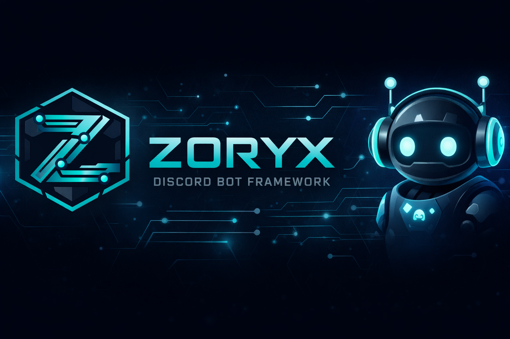

<p align="center">
  
</p>

<h1 align="center">🤖 Zoryx Discord Bot Framework</h1>

<p align="center">
  <strong>Advanced • Modular • Production-Ready</strong>
</p>

<p align="center">
  <a href="https://www.python.org/downloads/">
    
  </a>
  <a href="https://github.com/Rapptz/discord.py">
    
  </a>
</p>

<p align="center">
  A production-ready, enterprise-grade Discord bot framework featuring atomic file operations, advanced permission systems, dynamic extension loading, comprehensive monitoring, modular framework cogs, and an integrated extension marketplace.
</p>

<p align="center">
  **✨ NEW FEATURE (v1.6.0.1): AI Assistant (GeminiService Cog)**
  <br>Interact with your bot using natural language to get insights into its framework, plugins, diagnostics, database, files, and more!
</p>

<p align="center">
  🌐 <a href="https://zsync.eu/zdbf/">Website</a>
</p>
<div align="center">

## 🆕 NEW: Free Dashboard Hosting for ZDBF!

**🚀 ZORYX DashHost** - Host your Zoryx Discord Bot Framework dashboard for FREE  
No PHP hosting required • Instant setup • All features included

🔗 [Get Started](https://zsync.eu/zframedash/) • 📺 [Watch Tutorial](https://www.youtube.com/watch?v=TfSIV4mc_fo)


</div>


## 📑 Table of Contents

<details>
<summary><strong>Click to expand</strong></summary>
  
- [Important Notice / Data Protection](#important-notice--data-protection)
- [🌟 What Makes This Framework Special](#-what-makes-this-framework-special)
  - [🏗️ Enterprise-Grade Architecture](#️-enterprise-grade-architecture)
  - [🎯 Developer Experience](#-developer-experience)
  - [🔌 Modular Framework Cogs](#-modular-framework-cogs)
  - [🛒 Integrated Extension Marketplace](#-integrated-extension-marketplace)
  - [🎨 Modern User Interface](#-modern-user-interface)
  - [🔒 Advanced Security](#-advanced-security)
  - [📊 Comprehensive Monitoring](#-comprehensive-monitoring)
  - [🔧 Developer Tools](#-developer-tools)
- [🎯 Core Features](#-core-features)
- [📋 Requirements](#-requirements)
- [🐳 Docker Setup](#-docker-setup)
- [🚀 Quick Start](#-quick-start)
- [📁 Project Structure](#-project-structure)
- [🎮 Built-in Commands](#-built-in-commands)
  - [👥 User Commands](#-user-commands)
  - [🛒 Marketplace Commands](#-marketplace-commands)
  - [Atomic File System Commands](#atomic-file-system-commands)
  - [🔌 Plugin Registry Commands](#-plugin-registry-commands)
  - [📊 Framework Diagnostics Commands](#-framework-diagnostics-commands)
  - [🪝 Event Hooks Commands](#-event-hooks-commands)
  - [📡 Live Monitor Commands](#-live-monitor-commands)
  - [🤖 AI Assistant Commands](#-ai-assistant-commands)
  - [🔧 Owner-Only Commands](#-owner-only-commands)
- [🛒 Extension Marketplace](#-extension-marketplace)
- [🔧 Creating Extensions](#-creating-extensions)
- [⚙️ Configuration Guide](#️-configuration-guide)
- [🗄️ Database System](#️-database-system)
- [📊 Framework Cogs System](#-framework-cogs-system)
- [🛠 Troubleshooting](#-troubleshooting)
- [📈 Performance Tips](#-performance-tips)
- [📜 License](#-license)
- [🤝 Contributing](#-contributing)
- [💬 Support](#-support)
- [📚 Additional Resources](#-additional-resources)
- [🎉 Showcase](#-showcase)
- [👤 Author](#-author)

</details>

---

## 🌟 What Makes This Framework Special

### 🏗️ Enterprise-Grade Architecture

**Atomic File Operations**
- Thread-safe file handling with built-in LRU caching (300s TTL, 1000 entry limit)
- Automatic lock management with cleanup threshold (500 locks)
- Zero data corruption through tempfile-based atomic writes
- Cache invalidation and TTL-based expiration
- Cross-platform compatibility (Windows/Linux)

**Advanced Database Management**
- Per-guild SQLite databases with automatic connection pooling
- WAL (Write-Ahead Logging) mode for concurrent access
- Automatic backup system on shutdown
- Orphaned connection cleanup
- Global and guild-specific data separation
- Command usage analytics and statistics tracking

**Safe Log Rotation**
- Automatic size-based rotation (10MB default)
- Configurable backup count (5 backups default)
- Age-based cleanup (30-day retention)
- Dual-mode logging: permanent + current session
- Structured logging with timestamps and levels

### 🎯 Developer Experience

**Hot-Reload System**
- File-watching based auto-reload (30s interval)
- Extension modification timestamps tracked
- Zero downtime during development
- Load time tracking per extension
- Graceful error handling during reload

**Intelligent Extension Loading**
- Automatic whitespace handling (converts spaces to underscores)
- Extension blacklist support
- Load time tracking and diagnostics
- Conflict detection through Plugin Registry
- Dependency resolution system

**Hybrid Command System**
- Seamless prefix and slash command support
- Automatic command type indicators in help menu
- Slash command limit protection (100 command cap)
- Graceful degradation to prefix-only mode
- Visual indicators: ⚡ (hybrid), 🔸 (prefix-only), 🔹 (limit reached)

**Web-Based Monitoring Dashboard**
- Real-time bot status via Live Monitor cog (~12,000+ lines)
- 15+ dashboard tabs: Dashboard, Commands, Plugins, Hooks, Files, Chat, Guilds, Events, System, and more
- Remote extension management (load/unload/reload from browser)
- Full file browser with read/write/delete operations
- Chat console to send Discord messages from dashboard
- Role-based access control (Owner/Helper/Visitor)
- One-command dashboard deployment (`/livemonitor quickstart`)
- 2-second update interval for near real-time data
- Requires PHP hosting (Strato, Hostinger, any cPanel host)

### 🔌 Modular Framework Cogs

**Event Hooks System** (`cogs/event_hooks.py`)
- Internal event system for framework lifecycle events
- Priority-based callback execution
- **Asynchronous queue processing:**
  - 1000 event capacity with backpressure (5s wait before drop)
  - Queue delay tracking for performance monitoring
  - Worker auto-restart on crash (up to 10 attempts)
- **Circuit Breaker Pattern:**
  - Opens after 5 failures in 5 minutes
  - Disables hook for 60 seconds
  - Automatic recovery with manual override
  - Prevents cascading failures
- **Hook timeout protection:**
  - 10-second timeout per hook execution
  - Prevents blocking the entire queue
  - Timeout triggers circuit breaker
- **Performance monitoring:**
  - Execution time tracking per hook
  - Success/failure counts
  - Average execution time calculations
  - Queue delay metrics
- **Hook management:**
  - Disable/enable hooks without code changes
  - Status indicators (🔴 disabled, ⚠️ circuit open)
  - Manual circuit breaker reset
- **Alert system:**
  - Queue full notifications
  - Circuit breaker triggers
  - Worker crash alerts
  - Configurable alert channel
- Hook execution history (100 total, 20 per event)
- Built-in events: bot_ready, guild_joined, guild_left, command_executed, command_error
- Custom event emission support


**Plugin Registry** (`cogs/plugin_registry.py`)
- Automatic metadata extraction from extensions with error logging
- **Dependency validation and enforcement:**
  - Version comparison support (`>=`, `>`, `==`, `<=`, `<`)
  - Missing dependency detection
  - Version mismatch detection
- **Conflict detection and prevention:**
  - Bidirectional conflict checking
  - Automatic conflict alerts
- **Circular dependency detection:**
  - Prevents infinite dependency loops
  - Shows full dependency cycle path
- Command and cog enumeration
- Load time tracking per plugin
- Auto-registration on extension load via event hooks
- JSON-based registry persistence with enforcement settings
- **Alert system:**
  - Configurable alert channel
  - Validation issue warnings
  - Scan error notifications
- **Status indicators:**
  - ✅ Valid plugin
  - ⚠️ Warnings (conflicts, scan errors)
  - ❌ Missing dependencies
  - 🔄 Circular dependencies
- **Toggleable enforcement:**
  - Enable/disable dependency checking
  - Enable/disable conflict checking


**Framework Diagnostics** (`cogs/framework_diagnostics.py`)
- Real-time system health monitoring with three-tier status (healthy/degraded/critical)
- CPU, memory, threads, open files, and connections tracking
- Command/error rate metrics with automatic calculation
- Event loop lag monitoring (checks every second)
- Uptime and latency monitoring
- Extension load time analysis
- Automatic diagnostics generation every 5 minutes
- Alert system with configurable channel (`!fw_alert_channel`)
- Automatic alerts for:
  - Critical health status (≥10% error rate)
  - Degraded health status (≥5% error rate)
  - Event loop blocking/lag
  - Consecutive write failures (≥3 failures)
- Comprehensive diagnostics saved to JSON files:
  - `framework_diagnostics.json` - Full system report
  - `framework_health.json` - Real-time health metrics

**Slash Command Limiter** (`cogs/slash_command_limiter.py`)
- **Intelligent Discord 100-command limit management with automatic conversion**
- **Thread-safe singleton pattern** - Only one instance allowed per bot
- **Configurable thresholds:**
  - Warning threshold (default: 90/100)
  - Safe limit (default: 95/100) 
  - Hard limit (100/100)
- **Multi-layered interception system:**
  - `tree.add_command()` monkey-patching for dynamic command blocking
  - `Cog._inject()` interception for cog-level slash stripping
  - Prevents commands from ever reaching Discord's API
- **Intelligent command type detection:**
  - ✅ **Skips `HybridCommand`** - Already have prefix support, no conversion needed
  - ✅ **Skips `commands.Command`** - Already prefix-only
  - ✅ **Skips `app_commands.Group`** - Command groups cannot be converted
  - 🔄 **Converts `app_commands.Command`** - Pure slash commands to prefix equivalents
- **Advanced parameter conversion system:**
  - Automatic type detection from function signatures
  - **Discord object conversion:**
    - `discord.Member` / `discord.User` - Converts @mentions and IDs to Member objects
    - `discord.Role` - Converts role mentions and IDs to Role objects
    - `discord.TextChannel` / `discord.VoiceChannel` - Converts #channel mentions to Channel objects
  - **Primitive type handling:**
    - `int` - String to integer conversion
    - `float` - String to float conversion  
    - `bool` - Handles "true", "yes", "1", "y", "on" variations
  - **Intelligent error messages:**
    - Missing required parameters with usage examples
    - Type conversion failures with helpful hints
    - Guild context validation (DM protection)
- **Production-ready MockInteraction wrapper:**
  - Emulates full `discord.Interaction` object for seamless compatibility
  - Handles `interaction.response.send_message()`, `interaction.followup.send()`
  - Supports embeds, files, views (buttons/dropdowns), and all Discord features
  - Proper attribute forwarding: `guild`, `user`, `channel`, `permissions`, `command`
  - Modal support with graceful degradation message
- **Comprehensive tracking and logging:**
  - Blocked commands registry with timestamps and caller info
  - Converted commands tracking with conversion type metadata
  - Warning threshold system with automatic reset
  - Debug logging to `botlogs/debug_slashlimiter.log`
  - Caller tracking shows which file/line triggered blocking
- **Self-protection mechanisms:**
  - Limiter's own commands (`slashlimit`) exempted from blocking
  - Async startup to prevent bot hang during initialization  
  - Non-blocking background tasks for scanning
  - Graceful degradation on conversion failures
- **User-friendly status display (`/slashlimit`):**
  - Visual progress bars showing command usage
  - Color-coded status (green=safe, yellow=warning, red=critical)
  - Lists blocked and converted commands
  - Shows system status and verification state
- **Integration with help system:**
  - Command type indicators: ⚡ (hybrid), 🔸 (prefix-only), 🔹 (converted from slash)
  - Automatic updates when commands are converted
  - Real-time command count tracking

**🤖 AI Assistant (`cogs/GeminiService.py`)**
- **Powered by Google Gemini Pro:**
  - This cog integrates the advanced capabilities of the Google Gemini to serve as an intelligent AI assistant for the Zoryx Discord Bot Framework. It provides natural language understanding and generation, making complex bot operations and data accessible through simple queries.
- **Deep Contextual Awareness:**
  - The AI assistant's power lies in its ability to dynamically pull real-time data and context from various core framework components, enabling it to provide highly accurate and relevant answers.
  - **Seamless Integration with Framework Cogs:**
    - **`PluginRegistry`:** Fetches live data on all installed extensions, their metadata, dependencies, and potential conflicts to answer questions about your bot's plugins.
    - **`FrameworkDiagnostics`:** Accesses current health reports, performance metrics (CPU, memory, event loop lag), and error rates to provide on-demand diagnostic summaries.
    - **`SlashCommandLimiter`:** Understands the bot's slash command usage, including which commands have been converted to prefix commands due to Discord's API limits, and why.
    - **`EventHooks` & `EventHooksCreater`:** Provides insights into the internal event system, registered hooks, execution history, and user-created automations, helping you understand how the bot responds to events.
  - **Direct File & Database Introspection:**
    - **File Content Analysis:** Can read and summarize the content of any specified file within the bot's directory (with robust security checks to prevent path traversal), allowing the AI to explain code, configurations, or logs.
    - **Database Schema Querying:** Interacts with the bot's SQLite databases to answer natural language questions about table schemas, data structure, and even specific data points (e.g., "How many users have configured custom prefixes?").
    - **`README.md` Smart Search:** Utilizes advanced search capabilities to find and synthesize information directly from the bot's `README.md` file, making documentation queries instant and efficient.
- **Key Features for Enhanced Bot Management:**
  - **Natural Language Interaction:** Users can ask complex questions in plain English, eliminating the need to memorize specific commands or data structures.
  - **Interactive Help Menu:** A paginated, button-driven help menu guides users through the `/ask_zdbf` command's extensive capabilities, ensuring ease of discovery and use.
  - **Robust Error Handling & Timeout Prevention:** Implements immediate deferral of Discord interactions and comprehensive error handling, ensuring a smooth user experience even during lengthy AI processing times.
  - **Secure Operations:** All file and data access through the AI assistant is safeguarded by the framework's atomic file system and strict path validation, ensuring data integrity and preventing unauthorized access.

**📡 Live Monitor (`cogs/live_monitor.py`)**

- **Web-based dashboard for real-time bot monitoring and remote management**  
  _(~12,000+ lines of functionality)_
- **Acts as a bridge between the running Discord bot and an external PHP-powered monitoring interface**
- **⚠️ IMPORTANT:** The **Credits tab and visual design** are © 2025 **TheHolyOneZ**  
  These elements are **NOT covered by the MIT license** and **MUST remain visible and unmodified**

> 📺 **YouTube Tutorial & Showcase**  
> The full video tutorial is **now live** 🎉  
> It provides a complete walkthrough of the Live Monitor dashboard, showcases all features in action, and includes a step-by-step setup guide.  
>  
> 👉 **Watch here:**  
> https://www.youtube.com/watch?v=ir3AsxZOshw

**Server Requirements:**
- PHP 7.4+ hosting (shared hosting works fine - e.g., Strato, Hostinger, Bluehost, any cPanel host)
- SQLite3 PHP extension (usually pre-installed)
- HTTPS recommended for security
- No database server required (uses SQLite files)

**Dashboard Tabs (15 total):**
| Tab | Description |
|-----|-------------|
| Dashboard | Real-time bot stats, latency, uptime, guild/user counts |
| Commands | All prefix/slash/hybrid commands with usage stats |
| Plugins & Extensions | Loaded extensions, dependencies, conflicts, versions |
| Event Hooks | Hook status, circuit breakers, execution metrics |
| File System | Directory statistics, cache hits/misses, file counts |
| File Browser | Full file explorer with read/write/delete/rename/create |
| Chat Console (EXPERIMENTAL) | Send messages to Discord channels from dashboard |
| Guilds / Servers | All servers with member counts, channels, join dates |
| Events | Recent command executions, errors, guild joins/leaves |
| System | CPU, memory, threads, connections, platform info |
| Bot Invite Helper | Generate invite links with permission calculator |
| Database | Browse guild SQLite databases and tables |
| Roles & Access | Manage dashboard user roles (Owner/Helper/Visitor) |
| Security & Logs | Audit logs, login history, security events |
| Credits | Framework attribution (required to remain visible) |

> **NOTE** The number of tabs, and the tabs themselves, may be greater in the latest version! Right now, there are around 18 tabs. I couldn't update the readme, though, so I made this quick note right here. Just know that there are more tabs and more features!


**Generated PHP Files (quickstart creates these in `./live_monitor_website/`):**
| File | Purpose |
|------|---------|
| `index.php` | Main dashboard interface with all tabs |
| `receive.php` | Receives bot data via HTTP POST |
| `get_commands.php` | Bot polls this for pending commands |
| `send_command.php` | Dashboard sends commands to bot |
| `lm_bootstrap.php` | Core initialization and config |
| `lm_db.php` | SQLite database helper functions |
| `lm_auth.php` | Authentication and session management |
| `setup.php` | First-time claim wizard |
| `login.php` | Discord OAuth login page |
| `oauth_callback.php` | OAuth callback handler |
| `logout.php` | Session logout handler |
| `owner_audit.php` | Admin audit log viewer |
| `owner_roles.php` | Role management panel |
| `owner_db.php` | Database management panel |
| `backup_dashboard.php` | Bot backup interface |

**Slash Command (`/livemonitor`):**
```
/livemonitor action:<choice> [url:<text>] [interval:<number>]

Actions:
  • Quick Start (Setup + Files) - Generate dashboard files and configure
  • Status                      - Show current configuration and connection status
  • Enable                      - Start sending data to dashboard
  • Disable                     - Stop data transmission
  • Get Files                   - Regenerate dashboard files
```

**Prefix Command (`!livemonitor`):**
```
!livemonitor <action> [url] [interval]
  • !livemonitor status
  • !livemonitor quickstart https://yoursite.com/monitor
  • !livemonitor enable
  • !livemonitor disable
  • !livemonitor files
```

**Comprehensive data collection:**
  - Bot metadata (username, ID, guilds, users, latency, uptime, loaded cogs/extensions)
  - System resources via `psutil` (CPU%, memory MB/%, threads, open files, network connections, platform)
  - Guild summaries with member counts, text channels (with NSFW status), owner info, join dates
  - Command usage statistics with execution counts, last used timestamps, error tracking
  - Integration status of framework cogs (EventHooks, SlashLimiter, PluginRegistry, FrameworkDiagnostics)
  - Atomic File System cache stats (hits, misses, active locks, read/write counts)
  - Health metrics from FrameworkDiagnostics when available
  - Detailed plugin information via PluginRegistry integration
  - Available extensions scan from `./extensions` directory
  - Framework version info and documentation links
- **Event logging system:**
  - Listens to: `on_command`, `on_command_error`, `on_guild_join`, `on_guild_remove`, `on_message`, `on_app_command_completion`
  - Configurable event log capacity (`_max_event_log`: 1000 entries)
  - Hook execution history (`_max_hook_execution_log`: 1000 entries)
  - Message activity aggregation for engagement metrics
- **Remote command execution from web dashboard:**

| Command | Permission | Description |
|---------|------------|-------------|
| `reload_extension` | Helper+ | Hot-reload an extension |
| `load_extension` | Helper+ | Load a new extension |
| `unload_extension` | Helper+ | Unload an extension |
| `clear_cache` | Helper+ | Clear bot caches |
| `write_file` | Helper+ | Write/create files |
| `read_file` | Helper+ | Read file contents |
| `list_dir` | Helper+ | List directory contents |
| `rename_file` | Helper+ | Rename files |
| `create_dir` | Helper+ | Create directories |
| `delete_path` | Helper+ | Delete files/directories |
| `send_chat_message` | Helper+ | Send message to Discord channel |
| `shutdown_bot` | Owner | Gracefully stop the bot |
| `leave_guild` | Owner | Leave a Discord server |
| `backup_bot_directory` | Owner | Create bot backup archive |
| `fetch_marketplace_extensions` | Permission | Browse marketplace |
| `download_marketplace_extension` | Permission | Download from marketplace |

- **Role-based access control:**
  - **Owner** - Full access to all dashboard features including shutdown
  - **Helper** - Extension management, file operations, chat console
  - **Visitor** - Read-only access, view chat history
  - Granular permissions: `control_core`, `control_plugins`, `control_files`, `control_chat`, `control_hooks`, `control_guilds`, `control_backup`, `control_marketplace`
- **Task loop system (`send_status_loop`):**
  - 2-second update interval for near real-time monitoring
  - Multi-payload JSON packaging (core, commands, plugins, hooks, filesystem, etc.)
  - HTTP POST to configured `receive.php` endpoint
  - Command polling from `get_commands.php` endpoint
  - `aiohttp` client session management with configurable timeouts
  - Failure tracking (`send_failures`) with success state (`last_send_success`)
  - Graceful task cancellation on `asyncio.CancelledError`
  - Asset syncing (branding images) to remote server
- **Configuration (`data/live_monitor_config.json`):**
  - `enabled` - Toggle monitoring on/off
  - `website_url` - Dashboard URL
  - `secret_token` - Bot↔Server authentication token
  - `setup_token` - One-time dashboard claim token
  - `update_interval` - Seconds between updates (5-60)
- **Thread-safe file operations:**
  - `asyncio.Lock` (`_fileops_lock`) prevents race conditions
  - `asyncio.to_thread` for blocking I/O operations
  - Response tracking via `_fileops_response` dictionary
  - Concurrent command execution with `asyncio.create_task`
- **Security features:**
  - Token-based API authentication (32-byte cryptographic tokens)
  - Discord OAuth integration for dashboard login
  - One-time setup token prevents unauthorized claiming
  - Role-based command restrictions
  - Audit logging for all sensitive operations
  - HTTPS recommended for production
  
### 🛒 Integrated Extension Marketplace

**Direct Extension Installation**
- Browse official extensions from within Discord
- Search by keywords, categories, or status
- One-click installation with confirmation
- Automatic file writing to `./extensions` directory
- Post-install instructions with load commands

**ZygnalID System**
- Unique 16-character bot identifier
- Automatic generation on first use
- Required for extension downloads
- Enables dedicated support and tracking
- Stored securely in `./data/marketplace/ZygnalID.txt`

**License Agreement**
- Mandatory acceptance before marketplace access
- Per-user tracking of acceptance
- Usage restrictions enforcement
- Extension-specific licensing support
- Terms displayed in interactive embed

**Dependency Management**
- `!marketplace fixdeps` command
- Automatic log parsing for `ModuleNotFoundError`
- pip-based dependency installation
- Success/failure reporting per package
- Duplicate installation prevention

**Advanced Features**
- Extension categories: Working, Beta, Broken
- Custom URL support for extensions
- Version tracking and display
- Author attribution
- Extension status indicators
- Pagination for large lists (5 per page)
- Dropdown menus for selection
- Cache system (300s TTL) for API calls
- Rate limit handling with retry logic

### 🎨 Modern User Interface

**Interactive Help System**
- Dropdown-based category navigation
- Pagination for large command lists (5 per page)
- Visual command type indicators
- Automatic cog organization
- User-specific interaction validation
- Credits button with framework info
- Dynamic back navigation
- Real-time command count per category

**Rich Embeds Everywhere**
- Color-coded responses (success=green, error=red, warning=yellow)
- Consistent styling across all commands
- Timestamp inclusion
- Footer information
- Thumbnail support
- Field-based organization
- Progress bars for visual feedback

**Auto-Delete Messages**
- Configurable delete timers (5-15s)
- Success message cleanup
- Error message cleanup
- Reduces channel clutter
- User-friendly experience

### 🔒 Advanced Security

**Multi-Tier Permission System**
1. **Bot Owner**: Full access (from BOT_OWNER_ID env variable)
2. **Guild Owner**: Server management commands
3. **Role-Based**: Per-command role requirements
4. **Discord Permissions**: Native permission integration
5. **Hardcoded Restrictions**: Owner-only command list

**Interaction Security**
- User-specific button/dropdown validation
- Interaction author verification
- Ephemeral error messages
- Timeout-based view expiration (180-300s)
- Session-based state management

**Data Protection**
- Atomic file operations prevent corruption
- Database WAL mode for ACID compliance
- Automatic backups before shutdown
- File locking mechanism
- Cache invalidation on writes
- Secure temporary file handling

### 📊 Comprehensive Monitoring

**Metrics Collection**
- Real-time command tracking (LRU cache, 100 command limit)
- Message processing statistics
- Error rate monitoring
- Uptime tracking
- Top command analytics
- Per-command usage counts in database

**Health Monitoring**
- Error rate calculation
- Status determination (healthy/degraded)
- Latency tracking
- Extension load time analysis
- Database connection monitoring
- Cache performance metrics

**Diagnostics Dashboard**
- System information (Python version, platform, architecture)
- Bot statistics (guilds, users, channels)
- Extension analysis (count, load times)
- Command registration (prefix + slash)
- Performance metrics (CPU, memory, threads)
- Database health status

### 🔧 Developer Tools

**Atomic File Testing**
- Built-in `!atomictest` command
- Write/read/cache performance benchmarking
- Concurrent operation testing (10 simultaneous writes)
- Data integrity verification
- Cache statistics display

**Cache Management**
- `!cachestats` command for monitoring
- File cache size tracking
- Lock count monitoring
- Prefix cache statistics
- Metrics cache info
- Database connection counts

**Integrity Checks**
- `!integritycheck` command
- File system validation
- Database connection testing
- Cache system verification
- Extension loading checks
- Shard status monitoring
- Memory usage analysis

**System Cleanup**
- `!cleanup` command
- __pycache__ directory removal
- Expired prefix cache cleanup
- File lock cleanup
- Orphaned database connection removal
- Statistics reporting

---

## 🎯 Core Features

### System Architecture

✅ **Atomic File Operations** - Thread-safe file handling with LRU caching and retry logic
- Zero data corruption through tempfile-based writes
- 300s TTL, 1000 entry LRU cache
- Automatic lock cleanup (500 lock threshold)
- 3-attempt retry with exponential backoff
- Comprehensive metrics and health monitoring
- Diagnostic commands: `!atomicstats`, `!atomictest`
- Cache hit rate tracking and optimization
- Cross-platform compatibility (Windows/Linux)


✅ **SQLite Database** - Optimized with WAL mode and connection pooling  
✅ **Safe Log Rotation** - Automatic management with size and age limits  
✅ **Hot-Reload System** - File-watching based auto-reload (optional)  
✅ **Metrics Collection** - Real-time command tracking and analytics  
✅ **Framework Cogs** - Modular internal components with event system  
✅ **Auto-Sharding** - Built-in support for large-scale deployments  

### Command System

✅ **Hybrid Commands** - Both prefix and slash command support  
✅ **Permission Framework** - Multi-tier role-based access control  
✅ **AI Assistant** - Gemini-powered natural language introspection  
✅ **Command Autocomplete** - Dynamic suggestions for slash commands  
✅ **Cooldown Management** - Built-in rate limiting  
✅ **Auto-Delete Messages** - Automatic cleanup of responses  
✅ **Slash Limit Protection** - Automatic prefix-only fallback  
✅ **Command Type Indicators** - Visual markers in help menu  

### Extension Marketplace

✅ **Integrated Browser** - Browse extensions from Discord  
✅ **Search & Filter** - Find extensions by keywords or category  
✅ **One-Click Install** - Direct installation to bot  
✅ **License Agreement** - Mandatory acceptance system  
✅ **ZygnalID Support** - Unique bot identification  
✅ **Dependency Auto-Fix** - Automatic missing package installation  
✅ **Version Tracking** - Extension versioning support  

### User Interface

✅ **Interactive Help** - Dropdown navigation with pagination  
✅ **Rich Embeds** - Modern Discord UI with color coding  
✅ **User Validation** - Security-checked interactions  
✅ **Progress Bars** - Visual feedback for operations  
✅ **Category Organization** - Automatic command grouping  

### Configuration

✅ **Per-Guild Settings** - Custom prefixes and configurations  
✅ **JSON Config System** - Centralized configuration  
✅ **Command Permissions** - Granular role requirements  
✅ **Extension Blacklist** - Selective loading control  
✅ **Framework Cog Control** - Enable/disable components  

### Monitoring & Analytics

✅ **Command Usage Stats** - Track popular commands  
✅ **Error Tracking** - Comprehensive error logging  
✅ **Uptime Monitoring** - Real-time bot statistics  
✅ **Performance Metrics** - Load times and query tracking  
✅ **Health Monitoring** - System diagnostics and alerts  
✅ **Hook History** - Event system execution tracking  

---

## 📋 Requirements

**Python**: 3.8+ (Built and tested with 3.12.7)  
**discord.py**: 2.0+ (Built with 2.6.3)
```
aiofiles==24.1.0
aiohttp==3.12.14
aiosqlite==0.21.0
discord.py==2.6.3
python-dotenv==1.0.0
psutil==5.9.6
rich==14.0.0

```

---

## 🐳 Docker Setup


## 1. Clone the repository
```
git clone https://github.com/TheHolyOneZ/discord-bot-framework.git
cd discord-bot-framework
```
## 2. Build the Docker image
###    'discord-bot-framework' here is just the name you give the image. You can call it anything.
```
docker build -t discord-bot-framework .
```
## 3. Run the container
###    '```--name mybot```' gives a name to the running container. This is not your Python script name.
###    You can use this name to stop or remove the container later.
```
docker run -d --name mybot discord-bot-framework
```

---

## 🚀 Quick Start

### 1. Clone Repository
```bash
git clone https://github.com/TheHolyOneZ/discord-bot-framework.git
cd discord-bot-framework
```

### 2. Install Dependencies
```bash
pip install -r requirements.txt
```

### 3. Create `.env` File

Create `.env` in the root directory:
```env
DISCORD_TOKEN=Bot_Token
BOT_OWNER_ID=Your_DiscordID


# Sharding Configuration
SHARD_COUNT=1

# Can be commented out depending on your needs. If you want to use auto-sharding, leave (SHARD_IDS) commented out. 
# SHARD_IDS=0,1
```

**Getting Your User ID:**
1. Enable Developer Mode: User Settings → Advanced → Developer Mode
2. Right-click your username → Copy ID

**Getting Bot Token:**
1. Go to [Discord Developer Portal](https://discord.com/developers/applications)
2. Create New Application
3. Go to Bot section → Reset Token → Copy token

### 4. Configure Bot Intents

In the Discord Developer Portal:
1. Go to your application → Bot section
2. Enable these Privileged Gateway Intents:
   - ✅ Presence Intent
   - ✅ Server Members Intent
   - ✅ Message Content Intent

### 5. Run the Bot
```bash
python main.py
```

You should see a Rich console panel with bot statistics!

### 6. Invite Bot to Server

Generate invite URL in Developer Portal:
1. OAuth2 → URL Generator
2. Select Scopes: `bot`, `applications.commands`
3. Select Permissions: Administrator (or specific permissions)
4. Copy generated URL and open in browser

---

## 📁 Project Structure
```
discord-bot-framework/
│
├── main.py                      # Core bot logic and built-in commands
├── atomic_file_system.py        # Atomic operations and data management
│
├── extensions/                  # Your extension modules (auto-loaded)
│   ├── Put_Cogs_Extensions_here.txt
│   ├── example_logger.py        # Example extension
│   └── marketplace.py           # Extension Marketplace cog
│
├── cogs/                        # Framework internal cogs
│   ├── event_hooks.py           # Internal event system
│   ├── plugin_registry.py       # Plugin metadata & dependency tracking
│   ├── framework_diagnostics.py # Health monitoring
│   ├── live_monitor.py          # Web dashboard & remote management
│   ├── slash_command_limiter.py # Slash command protection
│   └── GeminiService.py         # AI assistant powered by Google Gemini
│
├── data/                        # Auto-generated data directory
│   ├── main.db                  # Global SQLite database
│   ├── main.db-wal              # WAL file for main DB
│   ├── main.db-shm              # Shared memory for main DB
│   ├── [guild_id]/              # Per-guild databases
│   │   ├── guild.db
│   │   └── guild_backup_*.db
│   ├── plugin_registry.json     # Plugin metadata cache
│   ├── framework_diagnostics.json # System diagnostics
│   ├── framework_health.json    # Health monitoring data
│   ├── live_monitor_config.json # Live Monitor settings
│   └── marketplace/
│       ├── ZygnalID.txt         # Unique bot identifier
│       └── license_accepted.json # License acceptance tracking
│
├── botlogs/                     # Log files
│   ├── permanent.log            # Persistent log (rotates at 10MB)
│   ├── permanent.log.1-5        # Backup logs
│   └── current_run.log          # Current session only
│
├── images/                      # Documentation images
│   ├── Terminal-1.png
│   ├── HelpMenu-Example.png
│   └── ... (showcase images)
│
├── assets/                      # Live Monitor dashboard assets (optional branding)
│   ├── zoryx-framework.png      # Dashboard logo
│   ├── zoryx-framework.ico      # Favicon
│   └── banner.png               # Banner image
│
├── live_monitor_website/        # Generated dashboard files (upload to PHP server)
│   ├── index.php                # Main dashboard interface (~10,000+ lines)
│   ├── receive.php              # Bot data reception endpoint
│   ├── get_commands.php         # Command polling endpoint
│   ├── send_command.php         # Command submission with role checks
│   ├── lm_bootstrap.php         # Core initialization and tokens
│   ├── lm_db.php                # SQLite database helpers
│   ├── lm_auth.php              # Authentication and sessions
│   ├── setup.php                # One-time claim wizard
│   ├── login.php                # Discord OAuth login
│   ├── oauth_callback.php       # OAuth callback handler
│   ├── logout.php               # Session logout
│   ├── owner_audit.php          # Admin audit log viewer
│   ├── owner_roles.php          # Role management panel
│   ├── owner_db.php             # Database admin panel
│   ├── backup_dashboard.php     # Bot backup interface
│   └── assets/                  # Copied branding assets
│
├── config.json                  # Bot configuration (auto-generated)
├── .env                         # Environment variables (YOU CREATE THIS)
├── requirements.txt             # Python dependencies
├── README.md                    # This file
├── LICENSE                      # MIT License
├── SECURITY.md                  # Security policy
├── CODE_OF_CONDUCT.md           # Code of conduct
└── CONTRIBUTING.md              # Contribution guidelines
```

---

## 🎮 Built-in Commands

### 👥 User Commands

| Command | Description | Cooldown | Hybrid |
|---------|-------------|----------|--------|
| `!help` / `/help` | Interactive help menu with dropdown navigation | 10s | ✅ |
| `!stats` / `/stats` | Bot statistics, metrics, and framework info | 10s | ✅ |
| `!extensions` / `/extensions` | List loaded user extensions and framework cogs | 10s | ✅ |
| `!discordbotframework` | Framework information and feature list | 10s | ✅ |
| `!shardinfo` / `/shardinfo` | Shard information and distribution | 10s | ✅ |
| `!setprefix <prefix>` | Set custom prefix for your server (Admin only) | - | ✅ |
| `!config [cmd] [role]` | Configure command permissions (Owner only) | - | ✅ |

### 🛒 Marketplace Commands

| Command | Description | Cooldown | Hybrid |
|---------|-------------|----------|--------|
| `!marketplace` / `/marketplace` | Main marketplace menu with quick actions | 5s | ✅ |
| `!marketplace browse` | Browse all available extensions | 10s | ✅ |
| `!marketplace search <query>` | Search extensions by keywords | 10s | ✅ |
| `!marketplace install <id>` | Install extension by ID | 30s | ✅ |
| `!marketplace info <id>` | View detailed extension information | 5s | ✅ |
| `!marketplace refresh` | Refresh extension cache | 60s | ✅ |
| `!marketplace fixdeps` | Auto-install missing dependencies (Owner) | 60s | ✅ |
| `!marketplace myid` | View your ZygnalID (Owner only) | - | ✅ |


### Atomic File System Commands

| Command | Description | Cooldown | Hybrid |
|---------|-------------|----------|--------|
| `!atomicstats` / `/atomicstats` | Display atomic file system statistics (Owner) | - | Yes |
| `!atomictest` / `/atomictest` | Run comprehensive atomic operations test suite (Owner) | - | Yes |


### 🔌 Plugin Registry Commands

| Command | Description | AI Query |
|---------|-------------|----------|
| `!pr_list` / `/pr_list` | List all registered plugins with status indicators | `/ask_zdbf action:plugins` |
| `!pr_info <name>` / `/pr_info` | Detailed information about a specific plugin | `/ask_zdbf action:plugins query:"tell me about [plugin]"` |
| `!pr_validate <name>` | Validate plugin dependencies and conflicts (Owner) | `/ask_zdbf action:plugins query:"does [plugin] have issues?"` |
| `!pr_enforce <mode>` | Toggle dependency/conflict enforcement (Owner) | - |
| `!pr_alert_channel [channel]` | Set alert channel for registry warnings (Owner) | - |

### 📊 Framework Diagnostics Commands

| Command | Description | AI Query |
|---------|-------------|----------|
| `!fw_diagnostics` / `/fw_diagnostics` | Display framework health and diagnostics (Owner) | `/ask_zdbf action:diagnose` |
| `!fw_alert_channel` / `/fw_alert_channel` | Set alert channel for framework diagnostics (Owner) | - |
| `!slashlimit` / `/slashlimit` | Check slash command usage and limits | `/ask_zdbf action:slash` |


### 🪝 Event Hooks Commands

| Command | Description | AI Query |
|---------|-------------|----------|
| `!eh_list` / `/eh_list` | Display registered hooks with metrics (Owner) | `/ask_zdbf action:hooks` |
| `!eh_history [limit]` / `/eh_history` | Display hook execution history (Owner) | `/ask_zdbf action:hooks query:"show hook history"` |
| `!eh_disable <hook_id>` | Disable a problematic hook (Owner) | - |
| `!eh_enable <hook_id>` | Re-enable a disabled hook (Owner) | - |
| `!eh_reset_circuit <hook_id>` | Reset circuit breaker for hook (Owner) | - |
| `!eh_alert_channel [channel]` | Set alert channel for event hooks (Owner) | - |

### 📡 Live Monitor Commands

| Command | Description | Cooldown | Hybrid |
|---------|-------------|----------|--------|
| `/livemonitor quickstart <url>` | Generate dashboard files and configure monitoring | - | ✅ |
| `/livemonitor status` | Show current configuration, connection status, failure count | - | ✅ |
| `/livemonitor enable` | Start sending data to dashboard (2-second intervals) | - | ✅ |
| `/livemonitor disable` | Stop all data transmission and command polling | - | ✅ |
| `/livemonitor files` | Regenerate dashboard PHP/HTML/JS files | - | ✅ |

**Note:** Live Monitor requires a PHP web server (e.g., Strato, Hostinger, any cPanel host). See the [Using Live Monitor](#using-live-monitor) section for complete setup instructions.

### 🤖 AI Assistant Commands

| Command | Description | Cooldown | Hybrid |
|---------|-------------|----------|--------|
| `/ask_zdbf <action> [query]` | Ask the AI assistant about the bot, its code, or data | 15s | ❌ (Slash Only) |

**Actions for `/ask_zdbf`:**
- **`help`**: Shows an interactive help menu for the AI assistant.
- **`framework`**: Ask a general question about the bot's architecture.
- **`plugins`**: Get an AI-powered analysis of installed plugins.
- **`diagnose`**: Receive a health report summary from the AI.
- **`database`**: Ask a question about the database schema in natural language.
- **`file`**: Ask a question about a specific file's content.
- **`extension`**: Inspect an extension file from the `/extensions` folder.
- **`slash`**: Inquire about the slash command auto-conversion system.
- **`hooks`**: Ask about the internal framework (EventHooks) event system.
- **`automations`**: Ask about user-created automations.
- **`readme`**: Ask a question about the bot's `README.md` file.
- **`permission`**: (Owner Only) Manage permissions for the AI assistant.

### 🔧 Owner-Only Commands

| Command | Description | Access |
|---------|-------------|--------|
| `!sync` / `/sync` | Force sync slash commands globally | Bot Owner |
| `!reload <extension>` | Hot-reload specific extension | Bot Owner |
| `!load <extension>` | Load extension | Bot Owner |
| `!unload <extension>` | Unload extension | Bot Owner |
| `!fw_diagnostics` | Display framework diagnostics and health | Bot Owner |
| `!fw_alert_channel <channel>` | Set alert channel for framework diagnostics | Bot Owner |
| `!cachestats` | Display cache statistics | Bot Owner |
| `!dbstats` | Display database connection stats | Bot Owner |
| `!integritycheck` | Run full system integrity check | Bot Owner |
| `!cleanup` | Clean up system cache and temp files | Bot Owner |

---

## 🛒 Extension Marketplace

### Overview

The integrated Extension Marketplace allows you to browse, search, and install official extensions directly from Discord without manual file downloads.

### Features

✅ **Browse Extensions** - View all available extensions with pagination  
✅ **Search Functionality** - Find extensions by keywords  
✅ **Category Filtering** - Filter by status (Working, Beta, Broken)  
✅ **One-Click Install** - Direct installation to `./extensions` directory  
✅ **License Agreement** - Mandatory acceptance before use  
✅ **ZygnalID System** - Unique bot identification for support  
✅ **Dependency Management** - Automatic missing package installation  
✅ **Version Tracking** - View extension versions and update dates  

### First-Time Setup

1. **Run marketplace command:**
```bash
!marketplace
```

2. **Accept License Agreement:**
   - Read the terms carefully
   - Click "✅ Accept License" button
   - Acceptance is tracked per-user

3. **Browse Extensions:**
   - Use dropdown menu or buttons
   - Search by keywords
   - Filter by categories

### Installing Extensions

**Method 1: Interactive Menu**
```bash
!marketplace
# Click "Browse All" button
# Select extension from dropdown
# Click "📦 Install Extension"
# Confirm installation
```

**Method 2: Direct Install**
```bash
!marketplace install <extension_id>
```

**Post-Installation:**
After successful installation:
```bash
# Load the extension immediately
!load extension_name

# Or reload if already loaded
!reload extension_name

# Or restart bot for auto-load
```

### ZygnalID System

**What is ZygnalID?**
- Unique 16-character identifier for your bot
- Auto-generated on first marketplace use
- Required for extension downloads
- Enables dedicated support and tracking

**View Your ID:**
```bash
!marketplace myid
```
(Owner only, sent via DM for security)

**Activation:**
If your ID is invalid or not activated:
1. Join ZygnalBot Discord: `gg/sgZnXca5ts`
2. Verify yourself
3. Open ticket for "Zygnal ID Activation"
4. Provide your ZygnalID from `!marketplace myid`

### Dependency Management

**Automatic Fix:**
If extensions fail to load due to missing Python packages:
```bash
!marketplace fixdeps
```

This command:
1. Scans `botlogs/current_run.log` for `ModuleNotFoundError`
2. Extracts missing package names
3. Automatically runs `pip install <package>`
4. Reports success/failure per package
5. Provides next steps for loading extensions

**Manual Installation:**
```bash
pip install package_name
!reload extension_name
```

### Marketplace Categories

**Working** ✅
- Fully functional extensions
- Tested and verified
- Production-ready

**Beta** ⚠️
- Experimental features
- May have minor issues
- Actively developed

**Broken** ❌
- Known issues
- Not recommended for use
- Awaiting fixes

### Extension Information

View detailed information about any extension:
```bash
!marketplace info <extension_id>
```

Displays:
- Full description
- Version number
- Status (Working/Beta/Broken)
- File type (PY/TXT)
- Upload date
- Custom URL (if available)
- Installation instructions

### Searching Extensions

**By Keyword:**
```bash
!marketplace search moderation
```

**By Title or Description:**
The search is case-insensitive and matches:
- Extension titles
- Description text
- Details field

### Cache Management

The marketplace caches API responses for 300 seconds (5 minutes).

**Force Refresh:**
```bash
!marketplace refresh
```

Use this when:
- New extensions are added
- Extension details are updated
- Cache shows outdated information

---

## 🔧 Creating Extensions

### Basic Extension Template
```python
import discord
from discord.ext import commands
from discord import app_commands

class MyExtension(commands.Cog):
    """Description of your extension"""
    
    def __init__(self, bot):
        self.bot = bot
        print(f"{self.__class__.__name__} initialized")
    
    @commands.hybrid_command(
        name="example",
        help="An example command that works with both prefix and slash"
    )
    @commands.cooldown(1, 5, commands.BucketType.user)
    async def example_command(self, ctx):
        """Command implementation"""
        embed = discord.Embed(
            title="✅ Success",
            description="This is an example command!",
            color=0x00ff00
        )
        await ctx.send(embed=embed)
    
    @commands.Cog.listener()
    async def on_message(self, message):
        """Event listener example"""
        if message.author.bot:
            return
        # Your logic here
    
    def cog_unload(self):
        """Cleanup when extension is unloaded"""
        print(f"{self.__class__.__name__} unloaded")

async def setup(bot):
    """Required setup function"""
    await bot.add_cog(MyExtension(bot))
```

### Using Atomic File Operations in Extensions

**Basic File Operations:**
```python
from atomic_file_system import global_file_handler

class MyExtension(commands.Cog):
    async def save_data(self, data: dict):
        # Atomic write with cache invalidation
        success = await global_file_handler.atomic_write_json(
            "./data/my_extension_data.json",
            data,
            invalidate_cache_after=True
        )
        return success
    
    async def load_data(self) -> dict:
        # Read with caching enabled (300s TTL)
        data = await global_file_handler.atomic_read_json(
            "./data/my_extension_data.json",
            use_cache=True
        )
        return data or {}
```

**Advanced Usage with Manual Cache Control:**
```python
class AdvancedExtension(commands.Cog):
    async def update_config(self, key: str, value: str):
        # Read current config (cached)
        config = await global_file_handler.atomic_read_json(
            "./data/config.json",
            use_cache=True
        ) or {}
        
        # Update config
        config[key] = value
        
        # Write and keep in cache (frequent reads)
        await global_file_handler.atomic_write_json(
            "./data/config.json",
            config,
            invalidate_cache_after=False  # Keep in cache
        )
    
    async def force_reload(self):
        # Bypass cache for critical reads
        config = await global_file_handler.atomic_read_json(
            "./data/config.json",
            use_cache=False
        )
        
        # Or manually invalidate cache
        global_file_handler.invalidate_cache("./data/config.json")
```

**Cache Statistics in Extensions:**
```python
class MonitoringExtension(commands.Cog):
    @commands.command()
    async def check_cache(self, ctx):
        stats = global_file_handler.get_cache_stats()
        
        await ctx.send(f"""
        Cache Performance:
        - Size: {stats['cache_size']}/{stats['max_cache_size']}
        - Hit Rate: {stats['hit_rate']}%
        - Total Ops: {stats['total_reads'] + stats['total_writes']}
        - Failures: {stats['write_failures'] + stats['read_failures']}
        """)
```


### Extension with Plugin Metadata
```python
import discord
from discord.ext import commands

# Plugin metadata (recommended for Plugin Registry)
__version__ = "1.0.0"
__author__ = "YourName"
__description__ = "A cool extension that does amazing things"
__dependencies__ = []  # List of required extensions
__conflicts__ = []     # List of incompatible extensions

class MyExtension(commands.Cog):
    def __init__(self, bot):
        self.bot = bot
        
        # Register with Plugin Registry (if available)
        if hasattr(bot, 'register_plugin'):
            bot.register_plugin(
                name="my_extension",
                version=__version__,
                author=__author__,
                description=__description__,
                dependencies=__dependencies__,
                conflicts_with=__conflicts__
            )
    
    @commands.hybrid_command(name="example")
    async def example_command(self, ctx):
        await ctx.send("Hello from my extension!")

async def setup(bot):
    await bot.add_cog(MyExtension(bot))
```

### Using Framework Event Hooks
```python
from discord.ext import commands
import discord

class HookedExtension(commands.Cog):
    def __init__(self, bot):
        self.bot = bot
        
        # Register hooks if Event Hooks system is available
        if hasattr(bot, 'register_hook'):
            # Priority: higher executes first (default: 0)
            bot.register_hook("extension_loaded", self.on_ext_loaded, priority=5)
            bot.register_hook("command_executed", self.on_cmd_used)
            bot.register_hook("bot_ready", self.on_bot_ready)
    
    async def on_ext_loaded(self, bot, extension_name: str, **kwargs):
        """Called when any extension is loaded"""
        print(f"Extension loaded: {extension_name}")
    
    async def on_cmd_used(self, bot, command_name: str, author, **kwargs):
        """Called when any command is executed"""
        print(f"Command {command_name} used by {author}")
    
    async def on_bot_ready(self, bot, bot_user, **kwargs):
        """Called when bot becomes ready"""
        print(f"Bot is ready: {bot_user}")
    
    def cog_unload(self):
        """Cleanup: Unregister hooks when cog unloads"""
        if hasattr(self.bot, 'unregister_hook'):
            self.bot.unregister_hook("extension_loaded", self.on_ext_loaded)
            self.bot.unregister_hook("command_executed", self.on_cmd_used)
            self.bot.unregister_hook("bot_ready", self.on_bot_ready)

async def setup(bot):
    await bot.add_cog(HookedExtension(bot))
```

### Using Database System
```python
from discord.ext import commands
import discord

class DatabaseExtension(commands.Cog):
    def __init__(self, bot):
        self.bot = bot
    
    @commands.hybrid_command(name="savedata")
    async def save_data(self, ctx, key: str, value: str):
        """Save data to guild database"""
        # Get guild-specific database connection
        conn = await self.bot.db._get_guild_connection(ctx.guild.id)
        
        # Create table if not exists
        await conn.execute("""
            CREATE TABLE IF NOT EXISTS custom_data (
                key TEXT PRIMARY KEY,
                value TEXT,
                user_id INTEGER,
                created_at TIMESTAMP DEFAULT CURRENT_TIMESTAMP
            )
        """)
        
        # Insert or replace data
        await conn.execute(
            "INSERT OR REPLACE INTO custom_data (key, value, user_id) VALUES (?, ?, ?)",
            (key, value, ctx.author.id)
        )
        await conn.commit()
        
        await ctx.send(f"✅ Saved: {key} = {value}")
    
    @commands.hybrid_command(name="getdata")
    async def get_data(self, ctx, key: str):
        """Retrieve data from guild database"""
        conn = await self.bot.db._get_guild_connection(ctx.guild.id)
        
        async with conn.execute(
            "SELECT value, user_id FROM custom_data WHERE key = ?",
            (key,)
        ) as cursor:
            row = await cursor.fetchone()
            
            if row:
                await ctx.send(f"📄 {key} = {row['value']} (saved by <@{row['user_id']}>)")
            else:
                await ctx.send(f"❌ No data found for key: {key}")

async def setup(bot):
    await bot.add_cog(DatabaseExtension(bot))
```

### Integration with Atomic File System

The database system uses the atomic file handler for:
- **Configuration persistence** - `config.json` written atomically
- **Plugin registry storage** - Registry JSON with ACID compliance
- **Framework diagnostics** - Diagnostic reports saved safely
- **Extension data** - Any JSON-based extension storage

**Benefits:**
- Zero data corruption even during crashes
- Concurrent access safety
- Automatic retry on transient failures
- Cache acceleration for frequently accessed files
- Lock-free reads (when cached)

**Performance Optimization:**
```python
# High-frequency reads (use cache)
prefix = await bot.config.get("prefix")  # Cached

# Critical writes (bypass cache)
await bot.config.file_handler.atomic_write_json(
    path, 
    data, 
    invalidate_cache_after=True
)

# Batch operations (manual cache management)
for item in items:
    await process_item(item)
global_file_handler.clear_all_cache()  # Clear after batch
```


### Using Atomic File Operations
```python
from discord.ext import commands
import discord
from atomic_file_system import global_file_handler
from datetime import datetime

class FileExtension(commands.Cog):
    def __init__(self, bot):
        self.bot = bot
        self.data_file = "./data/my_extension_data.json"
    
    @commands.hybrid_command(name="saveconfig")
    async def save_config(self, ctx, setting: str, value: str):
        """Save configuration atomically"""
        
        # Read existing data (with caching)
        existing_data = await global_file_handler.atomic_read_json(
            self.data_file,
            use_cache=True
        ) or {}
        
        # Update data
        existing_data[setting] = {
            "value": value,
            "set_by": ctx.author.id,
            "timestamp": datetime.now().isoformat()
        }
        
        # Atomic write (invalidates cache)
        success = await global_file_handler.atomic_write_json(
            self.data_file,
            existing_data,
            invalidate_cache_after=True
        )
        
        if success:
            await ctx.send(f"✅ Configuration saved: {setting} = {value}")
        else:
            await ctx.send("❌ Failed to save configuration")
    
    @commands.hybrid_command(name="getconfig")
    async def get_config(self, ctx, setting: str = None):
        """Retrieve configuration"""
        
        # Read with caching enabled (300s TTL)
        data = await global_file_handler.atomic_read_json(
            self.data_file,
            use_cache=True
        )
        
        if not data:
            await ctx.send("❌ No configuration found")
            return
        
        if setting:
            if setting in data:
                config = data[setting]
                await ctx.send(
                    f"📄 {setting} = {config['value']}\n"
                    f"Set by: <@{config['set_by']}>\n"
                    f"Time: {config['timestamp']}"
                )
            else:
                await ctx.send(f"❌ Setting not found: {setting}")
        else:
            # Display all settings
            embed = discord.Embed(
                title="⚙️ All Configurations",
                color=0x5865f2
            )
            for key, config in data.items():
                embed.add_field(
                    name=key,
                    value=f"Value: {config['value']}\nSet by: <@{config['set_by']}>",
                    inline=False
                )
            await ctx.send(embed=embed)

async def setup(bot):
    await bot.add_cog(FileExtension(bot))
```


### Advanced Extension with Permissions

```python
import discord
from discord.ext import commands
from discord import app_commands

class ModerationExtension(commands.Cog, name="Moderation"):
    """Moderation commands for server management"""
    
    def __init__(self, bot):
        self.bot = bot
    
    @commands.hybrid_command(
        name="ban",
        help="Ban a user from the server"
    )
    @commands.has_permissions(ban_members=True)
    @commands.bot_has_permissions(ban_members=True)
    @commands.guild_only()
    async def ban_user(
        self,
        ctx,
        member: discord.Member,
        *,
        reason: str = "No reason provided"
    ):
        """Ban a member with reason"""
        
        # Safety check
        if member.top_role >= ctx.author.top_role:
            await ctx.send("❌ You cannot ban this user (role hierarchy)")
            return
        
        # Perform ban
        await member.ban(reason=f"{reason} (By: {ctx.author})")
        
        # Log to database
        await self.bot.db.increment_command_usage("ban")
        
        # Send confirmation
        embed = discord.Embed(
            title="🔨 User Banned",
            description=f"**User:** {member.mention}\n**Reason:** {reason}",
            color=0xff0000,
            timestamp=discord.utils.utcnow()
        )
        embed.set_footer(text=f"Banned by {ctx.author}")
        
        await ctx.send(embed=embed)
        
        # Try to DM the user
        try:
            dm_embed = discord.Embed(
                title="You were banned",
                description=f"**Server:** {ctx.guild.name}\n**Reason:** {reason}",
                color=0xff0000
            )
            await member.send(embed=dm_embed)
        except:
            pass  # User has DMs disabled
    
    @commands.hybrid_command(
        name="kick",
        help="Kick a user from the server"
    )
    @commands.has_permissions(kick_members=True)
    @commands.bot_has_permissions(kick_members=True)
    @commands.guild_only()
    async def kick_user(
        self,
        ctx,
        member: discord.Member,
        *,
        reason: str = "No reason provided"
    ):
        """Kick a member with reason"""
        
        if member.top_role >= ctx.author.top_role:
            await ctx.send("❌ You cannot kick this user (role hierarchy)")
            return
        
        await member.kick(reason=f"{reason} (By: {ctx.author})")
        await self.bot.db.increment_command_usage("kick")
        
        embed = discord.Embed(
            title="👢 User Kicked",
            description=f"**User:** {member.mention}\n**Reason:** {reason}",
            color=0xff9900,
            timestamp=discord.utils.utcnow()
        )
        embed.set_footer(text=f"Kicked by {ctx.author}")
        
        await ctx.send(embed=embed)

async def setup(bot):
    await bot.add_cog(ModerationExtension(bot))
```


### Extension with Background Tasks
```python
import discord
from discord.ext import commands, tasks
from datetime import datetime

class TaskExtension(commands.Cog):
    """Extension with background tasks"""
    
    def __init__(self, bot):
        self.bot = bot
        self.message_count = 0
        self.hourly_report.start()
    
    def cog_unload(self):
        """Stop tasks when unloading"""
        self.hourly_report.cancel()
    
    @tasks.loop(hours=1)
    async def hourly_report(self):
        """Send hourly statistics report"""
        channel_id = self.bot.config.get("reports_channel_id")
        if not channel_id:
            return
        
        channel = self.bot.get_channel(channel_id)
        if not channel:
            return
        
        embed = discord.Embed(
            title="📊 Hourly Report",
            description=f"Messages tracked: {self.message_count}",
            color=0x5865f2,
            timestamp=datetime.utcnow()
        )
        
        stats = self.bot.metrics.get_stats()
        embed.add_field(
            name="Bot Statistics",
            value=f"Commands: {stats['commands_processed']}\nErrors: {stats['error_count']}",
            inline=False
        )
        
        await channel.send(embed=embed)
        self.message_count = 0  # Reset counter
    
    @hourly_report.before_loop
    async def before_hourly_report(self):
        """Wait until bot is ready"""
        await self.bot.wait_until_ready()
    
    @commands.Cog.listener()
    async def on_message(self, message):
        """Track messages"""
        if not message.author.bot:
            self.message_count += 1

async def setup(bot):
    await bot.add_cog(TaskExtension(bot))
```
### Extension with Custom Checks
```python
import discord
from discord.ext import commands

def is_admin_or_owner():
    """Custom check for admin or bot owner"""
    async def predicate(ctx):
        if ctx.author.id == ctx.bot.bot_owner_id:
            return True
        if ctx.guild and ctx.author.guild_permissions.administrator:
            return True
        raise commands.CheckFailure("You must be an administrator or bot owner")
    return commands.check(predicate)

def has_any_role(*role_names):
    """Custom check for any of the specified roles"""
    async def predicate(ctx):
        if not ctx.guild:
            raise commands.CheckFailure("This command cannot be used in DMs")
        
        member_roles = [role.name for role in ctx.author.roles]
        if any(role in member_roles for role in role_names):
            return True
        
        raise commands.CheckFailure(f"You need one of these roles: {', '.join(role_names)}")
    return commands.check(predicate)

class CustomChecksExtension(commands.Cog):
    def __init__(self, bot):
        self.bot = bot
    
    @commands.hybrid_command(name="adminonly")
    @is_admin_or_owner()
    async def admin_only_command(self, ctx):
        """Only admins and bot owner can use this"""
        await ctx.send("✅ You have admin privileges!")
    
    @commands.hybrid_command(name="staffonly")
    @has_any_role("Staff", "Moderator", "Admin")
    async def staff_only_command(self, ctx):
        """Only staff members can use this"""
        await ctx.send("✅ You are a staff member!")

async def setup(bot):
    await bot.add_cog(CustomChecksExtension(bot))

```

### Extension with Slash Command Options
```python

import discord
from discord.ext import commands
from discord import app_commands
from typing import Literal

class SlashOptionsExtension(commands.Cog):
    def __init__(self, bot):
        self.bot = bot
    
    @commands.hybrid_command(name="color")
    @app_commands.describe(
        color="Choose a color",
        intensity="Color intensity level"
    )
    async def color_command(
        self,
        ctx,
        color: Literal["red", "green", "blue"],
        intensity: int = 5
    ):
        """Command with slash options"""
        
        color_map = {
            "red": 0xff0000,
            "green": 0x00ff00,
            "blue": 0x0000ff
        }
        
        embed = discord.Embed(
            title=f"{color.capitalize()} Color",
            description=f"Intensity: {intensity}/10",
            color=color_map[color]
        )
        
        await ctx.send(embed=embed)
    
    @commands.hybrid_command(name="userinfo")
    @app_commands.describe(member="The member to get info about")
    async def userinfo_command(
        self,
        ctx,
        member: discord.Member = None
    ):
        """Get information about a user"""
        
        member = member or ctx.author
        
        embed = discord.Embed(
            title=f"User Info: {member}",
            color=member.color
        )
        embed.set_thumbnail(url=member.display_avatar.url)
        embed.add_field(name="ID", value=member.id, inline=True)
        embed.add_field(name="Joined", value=member.joined_at.strftime("%Y-%m-%d"), inline=True)
        embed.add_field(name="Roles", value=f"{len(member.roles)-1}", inline=True)
        
        await ctx.send(embed=embed)

async def setup(bot):
    await bot.add_cog(SlashOptionsExtension(bot))
```

### ⚙️ Configuration Guide
#### Auto-Generated config.json
On first run, the bot creates config.json with default settings:

```python

{
    "prefix": "!",
    "owner_ids": [],
    "auto_reload": true,
    "status": {
        "type": "watching",
        "text": "{guilds} servers"
    },
    "database": {
        "base_path": "./data"
    },
    "logging": {
        "level": "INFO",
        "max_bytes": 10485760,
        "backup_count": 5
    },
    "extensions": {
        "auto_load": true,
        "blacklist": []
    },
    "cooldowns": {
        "default_rate": 3,
        "default_per": 5.0
    },
    "command_permissions": {},
    "slash_limiter": {
        "max_limit": 100,
        "warning_threshold": 90,
        "safe_limit": 95
    },
    "framework": {
        "load_cogs": true,
        "enable_event_hooks": true,
        "enable_plugin_registry": true,
        "enable_framework_diagnostics": true,
        "enable_slash_command_limiter": true
    }
}
```

Configuration Options
Basic Settings
prefix (string)

Default command prefix
Default: "!"
Per-guild overrides supported via !setprefix

owner_ids (array)

Additional bot owner IDs
Default: []
Primary owner from BOT_OWNER_ID env variable

auto_reload (boolean)

Enable hot-reload for extensions
Default: true
Checks every 30 seconds for file changes

Status Configuration
status.type (string)

Activity type shown in Discord
Options: "playing", "watching", "listening", "competing"
Default: "watching"

status.text (string)

Status message with variables
Variables: {guilds}, {users}, {commands}
Default: "{guilds} servers"
Example: "with {users} users | {guilds} servers"

Database Configuration
database.base_path (string)

Base directory for database files
Default: "./data"
Contains main.db and per-guild databases

Logging Configuration
logging.level (string)

Logging level
Options: "DEBUG", "INFO", "WARNING", "ERROR", "CRITICAL"
Default: "INFO"

logging.max_bytes (integer)

Max log file size before rotation
Default: 10485760 (10MB)

logging.backup_count (integer)

Number of backup log files to keep
Default: 5

Extensions Configuration
extensions.auto_load (boolean)

Automatically load all extensions on startup
Default: true

extensions.blacklist (array)

Extension names to skip during auto-load
Default: []
Example: ["debug_cog", "test_extension"]

Cooldowns Configuration
cooldowns.default_rate (integer)

Default number of command uses
Default: 3

cooldowns.default_per (float)

Default cooldown period in seconds
Default: 5.0

Slash Command Limiter
slash_limiter.max_limit (integer)

Discord's hard limit for slash commands
Default: 100
Should not be changed

slash_limiter.warning_threshold (integer)

Command count to trigger warnings
Default: 90
Logs warning at this count

slash_limiter.safe_limit (integer)

Command count to start prefix-only mode
Default: 95
New extensions become prefix-only

Framework Cogs
framework.load_cogs (boolean)

Load framework internal cogs
Default: true
Disable to use minimal framework

framework.enable_event_hooks (boolean)

Enable Event Hooks system
Default: true

framework.enable_plugin_registry (boolean)

Enable Plugin Registry system
Default: true

framework.enable_framework_diagnostics (boolean)

Enable Framework Diagnostics system
Default: true

framework.enable_slash_command_limiter (boolean)

Enable Slash Command Limiter
Default: true

Command Permissions
Configure role-based command access:


```
# Grant @Moderator access to ban command
!config ban @Moderator

# Add multiple roles
!config kick @Moderator
!config kick @Admin

# View current permissions
!config

# Remove restrictions
!config ban none
```
### Configuration Storage:
```
{
    "command_permissions": {
        "ban": [123456789, 987654321],
        "kick": [123456789]
    }
}
```


### Custom Prefixes
Set per-guild prefixes:
```
# Set prefix to ?
!setprefix ?

# Now commands work with ?
?help
?stats

# Slash commands always work regardless of prefix
/help
/stats
```
### Database Storage:
#### Stored in guild-specific database at ./data/[guild_id]/guild.db


### Environment Variables
Required .env file:


```
# Required
DISCORD_TOKEN=your_bot_token_here
BOT_OWNER_ID=your_discord_user_id

# Optional: Sharding (for large bots)
SHARD_COUNT=2

# SHARD_IDS can be commented out
SHARD_IDS=0,1
```
### Sharding Configuration:

- SHARD_COUNT: Total number of shards
- SHARD_IDS: Comma-separated list of shard IDs to run
  - Leave empty for auto-sharding


### 🗄️ Database System
#### Architecture
The framework uses a hybrid database approach:

1. Main Database (./data/main.db)
  - Global bot statistics
  - Command usage tracking
  - Framework-wide data

2. Per-Guild Databases (./data/[guild_id]/guild.db)
  - Guild-specific settings
  - Custom prefixes
  - Extension data per guild

#### Database Features
✅ WAL Mode - Write-Ahead Logging for concurrent access
✅ Connection Pooling - Automatic per-guild connection management
✅ Automatic Backups - Created on bot shutdown
✅ Orphan Cleanup - Removes connections for left guilds
✅ Atomic Operations - ACID compliance


#### Using the Database
#### Accessing Main Database

```python

# Direct access to main database
async with self.bot.db.conn.execute(
    "SELECT * FROM global_stats WHERE key = ?",
    ("some_key",)
) as cursor:
    row = await cursor.fetchone()
```
#### Accessing Guild Database
```python

# Get guild-specific connection
conn = await self.bot.db._get_guild_connection(guild_id)

# Execute queries
await conn.execute(
    "INSERT INTO custom_table (data) VALUES (?)",
    (data,)
)
await conn.commit()
```
#### Built-in Database Methods
```python

# Set guild prefix
await bot.db.set_guild_prefix(guild_id, "?")

# Get guild prefix
prefix = await bot.db.get_guild_prefix(guild_id)

# Increment command usage
await bot.db.increment_command_usage("command_name")

# Get command statistics
stats = await bot.db.get_command_stats()
# Returns: [(command_name, count), ...]

# Cleanup guild data
await bot.db.cleanup_guild(guild_id)

# Backup databases
await bot.db.backup()  # All guilds
await bot.db.backup(guild_id)  # Specific guild

```


### Database Schema
#### Main Database
global_stats
```

CREATE TABLE global_stats (
    key TEXT PRIMARY KEY,
    value TEXT,
    updated_at TIMESTAMP DEFAULT CURRENT_TIMESTAMP
)
```

#### Guild Database
#### guild_settings
```
CREATE TABLE guild_settings (
    key TEXT PRIMARY KEY,
    value TEXT,
    updated_at TIMESTAMP DEFAULT CURRENT_TIMESTAMP
)
```
#### command_stats


```
CREATE TABLE command_stats (
    command_name TEXT PRIMARY KEY,
    usage_count INTEGER DEFAULT 0,
    last_used TIMESTAMP
)
```

### Database Maintenance
#### Automatic Maintenance (Every Hour):

- Cleans up orphaned connections
- Expires prefix cache entries
- Removes pycache directories
- Logs maintenance actions

Manual Cleanup:
```
!cleanup
```
View Database Stats:
```
!dbstats

```


### 📊 Framework Cogs System
#### Overview
**Framework cogs are internal system components that provide core functionality. They're located in ./cogs directory and are automatically loaded on startup (if enabled in config).**


#### Event Hooks System
File: cogs/event_hooks.py

**What It Does**
- Internal event system for framework lifecycle events
- Priority-based callback execution
- Asynchronous queue processing (1000 event capacity)
- Execution history tracking (100 total, 20 per event)
- Worker task for async event processing

#### Available Events: 

### Event Description Table

| Event Name            | Description                       | Parameters                               |
|-----------------------|-----------------------------------|-------------------------------------------|
| bot_ready             | Bot becomes ready                 | —                                         |
| guild_joined          | Bot joins a guild                 | guild                                     |
| guild_left            | Bot leaves a guild                | guild                                     |
| command_executed      | Command is executed               | command_name, author, guild               |
| command_error         | Command error occurs              | command_name, error, author, guild        |
| extension_loaded      | Extension is loaded (custom)      | extension_name                            |
| extension_unloaded    | Extension is unloaded (custom)    | extension_name                            |


### Atomic File System

File: `atomic_file_system.py`

**What It Does**
- Thread-safe atomic file operations with zero data corruption
- LRU cache system (300s TTL, 1000 entry limit)
- Automatic file lock management with cleanup
- Retry logic for write operations (3 attempts)
- Comprehensive diagnostics and metrics tracking

**Key Features:**

**Atomic Write Protection**
- Tempfile-based writes prevent partial updates
- Automatic retry on permission errors
- Windows/Linux compatible file operations
- Cross-platform atomic move operations

**LRU Cache System**
- Configurable TTL (default: 300 seconds)
- Automatic eviction when full (max 1000 entries)
- Cache hit rate tracking
- Manual invalidation support
- Thread-safe cache access

**Lock Management**
- Per-file lock acquisition
- Automatic cleanup of inactive locks (threshold: 500)
- Lock age tracking for diagnostics
- Deadlock prevention

**Performance Metrics**
- Read/write operation counters
- Cache hit rate calculation
- Failure rate monitoring
- Lock cleanup statistics

**Health Monitoring**
- Real-time failure rate tracking
- Three-tier status: Healthy (<1%), Degraded (1-5%), Critical (>5%)
- Operation history tracking


### Using Atomic File System

**View System Statistics:**
```bash
!atomicstats
```
Shows:
- Cache size and hit rate
- Active file locks
- Total read/write operations
- Failure rates and health status
- System uptime

**Run Diagnostic Tests:**
```bash
!atomictest
```
Performs:
1. Atomic write test
2. Read test without cache
3. Read test with cache (verifies caching)
4. Concurrent write test (10 simultaneous writes)
5. Cache invalidation test

**Performance Metrics:**
- Cache hit rate >70% is healthy
- Active locks should be <100 normally
- Failure rate should be <1%
- Lock cleanup runs automatically at 500+ locks


### Using Event Hooks

**Register a Hook:**
```python
# Register hook with priority
bot.register_hook("bot_ready", my_callback, priority=10)

# Hook callback signature
async def my_callback(bot, **kwargs):
    # bot: Bot instance
    # kwargs: Event-specific parameters
    pass
```

**Hook ID Format:**
- Format: `event_name:callback_name`
- Example: `bot_ready:on_bot_ready`
- Used for disabling/enabling specific hooks

**View Registered Hooks:**
```bash
!eh_list
```
Shows:
- All registered hooks by event
- Priority levels
- Execution counts and failure counts
- Average execution time
- Status indicators:
  - 🔴 - Hook disabled manually
  - ⚠️ - Circuit breaker open
  - No icon - Working normally

**View Execution History:**
```bash
# Last 10 executions
!eh_history

# Last 30 executions
!eh_history 30
```

**Manage Problematic Hooks:**
```bash
# Disable a hook that's causing issues
!eh_disable bot_ready:on_bot_ready

# Re-enable when fixed
!eh_enable bot_ready:on_bot_ready

# Reset circuit breaker (if hook keeps failing)
!eh_reset_circuit command_executed:log_command
```

**Set Alert Channel:**
```bash
# Set current channel
!eh_alert_channel

# Set specific channel
!eh_alert_channel #hook-alerts
```

**Automatic Alerts Sent For:**
- Queue full (dropped events)
- Circuit breaker opens (hook disabled due to failures)
- Worker crashes (with restart attempt count)
- Max restart attempts reached

**Built-in Events:**
- `bot_ready` - Bot becomes ready (kwargs: `bot_user`)
- `guild_joined` - Bot joins guild (kwargs: `guild`)
- `guild_left` - Bot leaves guild (kwargs: `guild`)
- `command_executed` - Command runs (kwargs: `command_name`, `author`, `guild`)
- `command_error` - Command error (kwargs: `command_name`, `error`, `author`, `guild`)

**Custom Events:**
```python
# Emit custom event from your extension
await bot.emit_hook("custom_event", custom_param="value")
```

**Circuit Breaker Behavior:**
1. Hook fails 5 times within 5 minutes
2. Circuit breaker opens (hook disabled)
3. Hook disabled for 60 seconds
4. Automatically closes after timeout
5. Can manually reset with `!eh_reset_circuit`

**Performance Considerations:**
- Each hook has 10-second timeout
- Queue processes sequentially (high-priority first)
- Average execution time tracked per hook
- Slow hooks should be optimized or disabled

**Unregister Hooks:**
```python
# In cog_unload()
bot.unregister_hook("event_name", my_callback)
```

### Using Framework Diagnostics

**View Current Health:**
```bash
!fw_diagnostics
```

**Set Alert Channel:**
```bash
# Set current channel as alert channel
!fw_alert_channel

# Set specific channel
!fw_alert_channel #alerts
```

**What Gets Monitored:**
- **Health Status:**
  - ✅ Healthy: Error rate < 5%
  - ⚠️ Degraded: Error rate 5-9.9%
  - 🚨 Critical: Error rate ≥ 10%

- **System Metrics:**
  - Memory usage (MB)
  - CPU percentage
  - Active threads
  - Open file handles
  - Network connections
  - Event loop lag (ms)

- **Bot Statistics:**
  - Uptime
  - Latency
  - Commands processed
  - Error count
  - Extensions loaded
  - Servers/users/channels

**Automatic Alerts:**
The system automatically sends alerts to your configured channel for:
- Health status changes (degraded/critical)
- Event loop lag above threshold (500ms)
- Repeated diagnostics write failures (3+ consecutive)

**Diagnostics Files:**
- `./data/framework_diagnostics.json` - Complete system snapshot (updated every 5 min)
- `./data/framework_health.json` - Real-time health metrics (updated every 5 min)

**Health Check Frequency:**
- Event loop lag: Every 1 second
- Health monitoring: Every 5 minutes
- Diagnostics generation: Every 5 minutes


### Using Plugin Registry

**List All Plugins:**
```bash
!pr_list
```
Shows all registered plugins with status indicators:
- ✅ - All checks passed
- ⚠️ - Has warnings (conflicts, scan errors)
- ❌ - Missing dependencies
- 🔄 - Circular dependency detected

**View Plugin Details:**
```bash
!pr_info extension_name
```
Shows:
- Version, author, description
- Commands and cogs provided
- Dependencies with version requirements
- Conflict status
- Circular dependency paths (if any)
- Scan errors (if any)

**Validate Plugin:**
```bash
!pr_validate extension_name
```
Checks if a plugin is safe to load by validating:
- All dependencies are met
- No conflicts with loaded plugins
- No circular dependencies

**Toggle Enforcement:**
```bash
# Toggle dependency enforcement
!pr_enforce deps

# Toggle conflict enforcement
!pr_enforce conflicts
```
When enforcement is **enabled** (default):
- Plugins with issues trigger warnings
- Validation errors are logged

When enforcement is **disabled**:
- Plugins load regardless of issues
- Only informational warnings

**Set Alert Channel:**
```bash
# Set current channel
!pr_alert_channel

# Set specific channel
!pr_alert_channel #plugin-alerts
```

**Automatic Alerts Sent For:**
- Plugins loaded with missing dependencies
- Plugins loaded with conflicts
- Extension scan failures
- Circular dependency detection

**Version Requirements:**

In your extension, specify dependencies with versions:
```python
# Supports: >=, >, ==, <=, 
__dependencies__ = {
    "other_extension": ">=1.0.0",
    "another_ext": "==2.5.1"
}
```

**Conflict Declaration:**
```python
# List incompatible extensions
__conflicts__ = ["incompatible_ext", "old_version_ext"]
```

**Registry File:**
- Location: `./data/plugin_registry.json`
- Auto-saved on changes
- Contains all plugin metadata
- Includes enforcement settings

#### Priority System

- Higher priority = executes first
- Default priority: 0
- Range: any integer
- Example: priority=15 runs before priority=10


#### Commands
```
# View registered hooks (Owner only)
!hooks

# View execution history (Owner only)
!hookhistory [limit]
```

### Using Live Monitor

> 📺 **VIDEO TUTORIAL COMING SOON!**  
> A full YouTube video tutorial is in the works! It will cover:
> - 🎬 Complete dashboard showcase and feature walkthrough
> - ⚙️ Step-by-step setup guide from start to finish
> - 💡 Tips and best practices for production use
> - 🔧 Troubleshooting common issues
>
> Keep an eye on the [ZygnalBot YouTube channel](https://youtube.com/@zygnalbot) or the Discord server for the announcement!

**⚠️ IMPORTANT LICENSE NOTICE:**
The Credits tab and visual design of the Live Monitor dashboard are © 2025 TheHolyOneZ and are NOT covered by the MIT license. The Credits section (layout, wording, and SVG crown artwork) MUST remain clearly visible at all times in any use or modification of this dashboard.

---

#### Server Requirements

Live Monitor requires a PHP web server to host the dashboard. Any standard shared hosting works:

| Provider | Notes |
|----------|-------|
| **Strato** | Cheap, reliable German hosting - works great |
| **Hostinger** | Budget-friendly, good performance |
| **Bluehost** | Popular cPanel hosting |
| **Any cPanel host** | Standard PHP hosting works |
| **VPS (Nginx/Apache)** | Full control option |

**Technical Requirements:**
- PHP 7.4 or higher
- SQLite3 PHP extension (usually pre-installed)
- HTTPS strongly recommended
- ~50MB storage for dashboard + data files
- No MySQL/PostgreSQL required (uses SQLite)

---

#### Quick Setup Guide

**Step 1: Run Quickstart Command**
```bash
# Slash command
/livemonitor action:Quick Start (Setup + Files) url:https://yoursite.com/monitor

# Or prefix command
!livemonitor quickstart https://yoursite.com/monitor
```

This generates files in `./live_monitor_website/` folder.

**Step 2: Upload Files to Your Server**

Upload the entire contents of `./live_monitor_website/` to your web server:
```
yoursite.com/monitor/
├── index.php
├── receive.php
├── get_commands.php
├── send_command.php
├── lm_bootstrap.php
├── lm_db.php
├── lm_auth.php
├── setup.php
├── login.php
├── oauth_callback.php
├── logout.php
├── owner_audit.php
├── owner_roles.php
├── owner_db.php
├── backup_dashboard.php
└── assets/
    └── (branding images if present)
```

**Step 3: Claim Your Dashboard**

1. Visit `https://yoursite.com/monitor/setup.php`
2. Enter the **Setup Token** shown in Discord after quickstart
3. This one-time token prevents others from claiming your dashboard
4. You become the Owner with full access

**Step 4: Enable Monitoring**
```bash
/livemonitor action:Enable
# or
!livemonitor enable
```

Your dashboard is now live! Data updates every 2 seconds.

---

#### Dashboard Tabs Explained

| Tab | What You Can Do |
|-----|-----------------|
| **Dashboard** | View bot status, latency graph, uptime, guild/user counts at a glance |
| **Commands** | See all commands with usage counts, filter by type (hybrid/prefix/slash), view errors |
| **Plugins & Extensions** | Manage extensions - reload/unload/load, view dependencies and conflicts |
| **Event Hooks** | Monitor hook execution times, circuit breaker status, disable problematic hooks |
| **File System** | View directory statistics, cache hit rates, storage usage |
| **File Browser** | Full file explorer - navigate, read, edit, create, delete files |
| **Chat Console** | Send messages to Discord channels directly from dashboard (experimental) |
| **Guilds / Servers** | List all servers with member counts, channels, owner info, leave servers |
| **Events** | Real-time event log - command executions, errors, guild joins/leaves |
| **System** | CPU/memory usage, thread count, open files, network connections |
| **Bot Invite Helper** | Generate invite links with customizable permissions |
| **Database** | Browse per-guild SQLite databases, view tables and data |
| **Roles & Access** | Manage dashboard users - assign Owner/Helper/Visitor roles |
| **Security & Logs** | View audit logs, login history, security events |
| **Credits** | Framework attribution (MUST remain visible per license) |

---

#### Role-Based Access

| Role | Capabilities |
|------|-------------|
| **Owner** | Full access - shutdown bot, leave guilds, manage roles, all file operations |
| **Helper** | Extension management, file operations, send chat messages, view all data |
| **Visitor** | Read-only access, view dashboard data, view chat history |

**Granular Permissions:**
- `control_core` - Shutdown, diagnostics
- `control_plugins` - Load/unload/reload extensions
- `control_files` - File browser operations
- `control_chat` - Send Discord messages
- `control_hooks` - Enable/disable hooks
- `control_guilds` - Leave servers
- `control_backup` - Create backups
- `control_marketplace` - Download marketplace extensions

---

#### Commands Reference

**Check Status:**
```bash
/livemonitor action:Status
# or
!livemonitor status
```
Shows: enabled state, dashboard URL, last successful transmission, failure count, update interval.

**Enable/Disable:**
```bash
/livemonitor action:Enable
/livemonitor action:Disable
# or
!livemonitor enable
!livemonitor disable
```

**Regenerate Dashboard Files:**
```bash
/livemonitor action:Get Files
# or
!livemonitor files
```
Creates fresh dashboard files without changing your tokens.

**Change Update Interval:**
```bash
/livemonitor action:Quick Start url:https://yoursite.com/monitor interval:10
```
Set interval between 5-60 seconds (default: 5).

---

#### Remote Commands (from Dashboard)

| Command | Description |
|---------|-------------|
| **Extension Management** | |
| `reload_extension` | Hot-reload an extension without restart |
| `load_extension` | Load a new extension |
| `unload_extension` | Unload an extension |
| **File Operations** | |
| `read_file` | Read file contents |
| `write_file` | Create or overwrite files |
| `list_dir` | List directory contents |
| `rename_file` | Rename files or directories |
| `create_dir` | Create new directories |
| `delete_path` | Delete files or directories |
| **Bot Control** | |
| `shutdown_bot` | Gracefully stop the bot (Owner only) |
| `leave_guild` | Leave a Discord server (Owner only) |
| `backup_bot_directory` | Create backup archive (Owner only) |
| `clear_cache` | Clear bot caches |
| `send_chat_message` | Send message to Discord channel |
| **Marketplace** | |
| `fetch_marketplace_extensions` | Browse available extensions |
| `download_marketplace_extension` | Download and install extension |
| `load_downloaded_extension` | Load newly downloaded extension |

---

#### Configuration File

**Location:** `./data/live_monitor_config.json`

```json
{
    "enabled": true,
    "website_url": "https://yoursite.com/monitor",
    "secret_token": "abc123...",
    "setup_token": "xyz789...",
    "update_interval": 5
}
```

| Setting | Description |
|---------|-------------|
| `enabled` | Whether monitoring is active |
| `website_url` | Your dashboard URL |
| `secret_token` | 32-byte token for bot↔server auth |
| `setup_token` | One-time token for claiming dashboard |
| `update_interval` | Seconds between data transmissions |

---

#### Collected Data

| Category | Data Points |
|----------|-------------|
| **Bot Info** | Username, ID, guild count, user count, latency, uptime |
| **System** | CPU%, memory MB/%, threads, open files, connections, platform |
| **Guilds** | Names, IDs, member counts, owners, channels (with NSFW status), join dates |
| **Commands** | All commands with type, usage count, last used, error count, aliases |
| **Extensions** | Loaded cogs, versions, authors, dependencies, conflicts |
| **Hooks** | Event hooks with execution counts, failure rates, circuit breaker status |
| **Atomic FS** | Cache size, hit rate, active locks, read/write counts |
| **Events** | Command executions, errors, guild joins/leaves, message activity |

---

#### Security Best Practices

1. **Use HTTPS** - Tokens are transmitted in URLs
2. **Keep setup token secret** - Only shown once after quickstart
3. **Monitor audit logs** - Check Security tab regularly
4. **Limit Helper access** - Only trusted users
5. **Regular backups** - Use backup feature before major changes

---

#### Troubleshooting

**Dashboard not receiving data:**
- Check `!livemonitor status` for failures
- Verify URL is correct and accessible
- Check PHP error logs on server
- Ensure `receive.php` has write permissions

**Can't claim dashboard:**
- Setup token is one-time use
- Run quickstart again for new token
- Check if `lm_bootstrap.php` exists

**Commands not executing:**
- Check your role has required permissions
- View Security & Logs tab for denied commands
- Verify bot is running and connected

# 🔐 Security Features

### Atomic File System Security

**Data Integrity:**
- Tempfile-based writes prevent partial updates
- Atomic move operations (all-or-nothing)
- Automatic retry on transient failures
- Lock-based concurrency control
- Cache invalidation on successful writes

**Protection Against:**
- Race conditions (per-file locks)
- Partial writes (tempfile staging)
- Data corruption (atomic moves)
- Concurrent access (lock management)
- Cache inconsistency (TTL + invalidation)

**Monitoring:**
- Real-time failure tracking
- Health status calculation
- Comprehensive operation logging
- Test suite for verification

## Permission System

### Multi-Tier Hierarchy

#### **Bot Owner (Highest Priority)**

* Full access to all commands
* Defined in `BOT_OWNER_ID` environment variable
* Cannot be overridden

#### **Guild Owner**

* Access to server management commands
* Can configure command permissions
* Automatically detected via `guild.owner_id`

#### **Configured Roles**

* Per-command role requirements
* Set via `!config` command
* Stored in `config.json`

#### **Discord Permissions**

* Uses native Discord permission checks
* `@commands.has_permissions()`
* `@commands.bot_has_permissions()`

#### **Public Commands**

* No restrictions
* Available to all users

---

## Hardcoded Owner-Only Commands

These commands **cannot** be configured for other users:

```python
BOT_OWNER_ONLY_COMMANDS = [
    "reload", "load", "unload", "sync",
    "atomictest", "cachestats", "shardinfo",
    "dbstats", "integritycheck", "cleanup"
]
```

---

## Check Functions

### `is_bot_owner()`

```python
@commands.command()
@is_bot_owner()
async def owner_command(ctx):
    await ctx.send("Owner only!")
```

### `is_bot_owner_or_guild_owner()`

```python
@commands.command()
@is_bot_owner_or_guild_owner()
async def management_command(ctx):
    await ctx.send("Owner or guild owner!")
```

### `has_command_permission()`

```python
@commands.command()
@has_command_permission()
async def configurable_command(ctx):
    await ctx.send("Permission checked!")
```

---

# 🛡️ Interaction Security

### **User Validation**

```python
async def interaction_check(self, interaction):
    if interaction.user != self.author:
        await interaction.response.send_message(
            "❌ Only the command user can use this!",
            ephemeral=True
        )
        return False
    return True
```

### **View Timeouts**

* Default: **180–300 seconds**
* Automatically disables interactions after timeout
* Prevents stale UI elements

---

# 🗄️ Data Protection

## Atomic File Operations

Prevents:

* Data corruption during concurrent writes
* Partial file writes
* File locking issues

**How it works:**

1. Write to temporary file
2. Verify success
3. Atomic move to final location
4. Invalidate cache

---

## Database Safety

### **WAL Mode**

* Write-Ahead Logging
* Concurrent reads during writes
* ACID compliant
* Crash recovery

### **Connection Pooling**

* Per-guild isolation
* Automatic cleanup
* Lock-safe operation

### **Backups**

* Automatic on shutdown
* Manual via `!dbstats`
* Timestamped backup files

---

## File Locking

### **LRU Cache with Locks**

* Per-file lock acquisition
* Automatic cleanup (500 lock threshold)
* Prevents concurrent write conflicts

---

# 🛒 Marketplace Security

### **ZygnalID System**

* Unique bot identification
* Required for extension downloads
* Activation verification

### **License Agreement**

* Mandatory acceptance
* Per-user tracking
* Enforces usage restrictions

### **File Safety**

* Extensions stored in isolated directory
* Never auto-executed
* Manual loading required

---

# 🎨 Customization

## Embed Colors

Default color scheme:

```python
# Success
SUCCESS = 0x00ff00

# Error
ERROR = 0xff0000

# Warning
WARNING = 0xffff00

# Info
INFO = 0x5865f2

# Main Menu
MAIN_MENU = 0x2b2d31

# Credits
CREDITS = 0xffd700
```

### Custom Embed Example

```python
embed = discord.Embed(
    title="Custom Title",
    description="Custom Description",
    color=0x9b59b6  # Purple
)
```

---

## Emojis

Common Unicode emojis:

```python
# Status
"✅"  # Success
"❌"  # Error
"⚠️"  # Warning
"ℹ️"  # Info

# Actions
"🔄"  # Reload
"📊"  # Stats
"⚙️"  # Settings
"🔧"  # Tools

# Navigation
"◀"  # Previous
"▶"  # Next
"🏠"  # Home

# Categories
"📚"  # Help
"📦"  # Extensions
"🗄️"  # Database
"📊"  # Statistics
```

---

# 📝 Custom Status

Edit `config.json`:

```json
{
    "status": {
        "type": "watching",
        "text": "{guilds} servers | {users} users"
    }
}
```

### Available Types

* `playing`
* `watching`
* `listening`
* `competing`

### Available Variables

* `{guilds}` – Total server count
* `{users}` – Total user count
* `{commands}` – Total command count

---

# 🔧 Custom Prefix

### Global Default

```json
{
    "prefix": "?"
}
```

### Per-Guild

```bash
!setprefix ?
```

---

# 🆘 Custom Help Menu

```python
@bot.hybrid_command(name="myhelp")
async def custom_help(ctx):
    embed = discord.Embed(
        title="My Custom Help",
        description="Custom help menu",
        color=0x5865f2
)
# Add your fields
await ctx.send(embed=embed)
```

Then disable the built-in help in `main.py`:
Then disable the built-in help in `main.py`:
```python
bot = BotFrameWork(
    command_prefix=lambda b, m: b.get_prefix(m),
    intents=intents,
    help_command=None,  # Disable built-in help
    # ... other options
)
```

---

## 🛠 Troubleshooting

### Bot Won't Start

**Error: `DISCORD_TOKEN not found in .env!`**

Solution:
1. Create `.env` file in root directory
2. Add: `DISCORD_TOKEN=your_token_here`
3. Ensure no quotes around token
4. Ensure file is named `.env` not `.env.txt`

**Error: `BOT_OWNER_ID not found in .env!`**

Solution:
1. Add to `.env`: `BOT_OWNER_ID=your_user_id`
2. Get ID by enabling Developer Mode in Discord
3. Right-click your username → Copy ID

**Error: `discord.ext.commands.errors.ExtensionFailed`**

Solution:
1. Check logs: `cat botlogs/current_run.log`
2. Look for syntax errors in extension
3. Ensure all imports are available
4. Use `!marketplace fixdeps` for missing packages

### Atomic File System Issues

**High Cache Miss Rate (<50%):**

Solution:
1. Check if files are being modified externally
2. Verify cache TTL isn't too short (default: 300s)
3. Run `!atomicstats` to view statistics
4. Consider increasing `max_cache_size` in code

**Many Active Locks (>100):**

Solution:
1. Check `!atomicstats` for lock count
2. Locks cleanup automatically at 500 threshold
3. Restart bot if locks are permanently stuck
4. Review code for proper async/await usage

**Write Failures:**

Solution:
1. Check file permissions in `./data` directory
2. Ensure sufficient disk space
3. Verify no external process is locking files
4. Check `!atomicstats` for failure patterns
5. Review logs for specific error messages

**Cache Not Invalidating:**

Solution:
```python
# Manual invalidation in code
global_file_handler.invalidate_cache("./data/problematic_file.json")

# Or clear all cache
global_file_handler.clear_all_cache()
```

**Performance Degradation:**

Solution:
1. Check `!atomicstats` for health status
2. If failure rate >5%, check disk I/O
3. Monitor lock count (should be <50 normally)
4. Run `!atomictest` to verify system health
5. Consider restarting bot if critical

### Extensions Not Loading

**Check logs:**
```bash
# Linux/Mac
cat botlogs/current_run.log | grep -i "extension"

# Windows
findstr /i "extension" botlogs\current_run.log
```

**Common Issues:**

1. **Missing `setup` function**
```python
   # Required in every extension
   async def setup(bot):
       await bot.add_cog(YourCog(bot))
```

2. **Syntax errors**
   - Check Python syntax
   - Ensure proper indentation
   - Validate imports

3. **Extension in blacklist**
   - Check `config.json` → `extensions.blacklist`
   - Remove extension name from list

4. **File not in `extensions/` directory**
   - Move file to `./extensions/`
   - Ensure `.py` extension

5. **Spaces in filename**
   - Framework auto-renames to underscores
   - Use `!load extension_name` (with underscores)

6. **Missing dependencies**
   - Use `!marketplace fixdeps`
   - Or manual: `pip install package_name`

### Slash Commands Not Syncing

**Manual sync:**
```bash
!sync
```

**Rate Limiting:**
- Discord limits syncs to ~2 per hour
- Bot automatically waits and retries
- Check logs for retry messages
- Wait 1 hour if rate limited

**Slash Command Limit Reached:**
```bash
# Check current usage
!slashlimit

# If at limit (100 commands):
# - New extensions become prefix-only
# - Existing slash commands still work
# - Unload unused extensions to free slots
```

**Verification:**
```bash
# Check registered commands
!extensions

# View slash command count
!stats
```

### Database Errors

**Error: `database is locked`**

Solution:
1. Ensure only one bot instance running
2. Wait for WAL checkpoint to complete
3. Restart bot if persists

**Backup and Reset:**
```bash
# Backup current database
cp data/main.db data/main.db.backup
cp -r data/[guild_id] data/[guild_id].backup

# Delete database (will regenerate)
rm data/main.db
rm -rf data/[guild_id]

# Restart bot
python main.py
```

**Check Database Stats:**
```bash
!dbstats
```

### Permission Errors

**"Missing Permissions" error:**

Solution:
1. Check bot has required Discord permissions
2. Verify role hierarchy (bot role above target roles)
3. Enable necessary intents in Developer Portal
4. Check bot permissions in channel settings

**"You don't have permission" error:**

Solution:
1. Check command permissions: `!config`
2. Verify your roles match requirements
3. Contact bot owner for access
4. Check if command is owner-only

### Memory/Performance Issues

**High Memory Usage:**

Solution:
1. Run `!cleanup` to clear caches
2. Check `!cachestats` for large caches
3. Reduce cache TTL in `atomic_file_system.py`
4. Restart bot periodically

**Slow Command Response:**

Solution:
1. Check `!stats` for latency
2. View `!dbstats` for connection issues
3. Run `!integritycheck` for system health
4. Check database file sizes
5. Consider sharding for large bots

### Marketplace Issues

**"Invalid or not activated" ZygnalID:**

Solution:
1. Get ID: `!marketplace myid` (Owner only)
2. Join ZygnalBot Discord: `gg/sgZnXca5ts`
3. Verify yourself in server
4. Open ticket for "Zygnal ID Activation"
5. Provide your ZygnalID in ticket

**Extension Install Failed:**

Solution:
1. Check error message for details
2. Verify bot has write permissions to `./extensions`
3. Ensure sufficient disk space
4. Try `!marketplace refresh`
5. Check logs: `botlogs/current_run.log`

**Missing Dependencies After Install:**

Solution:
```bash
# Automatic fix
!marketplace fixdeps

# Manual fix
pip install package_name
!reload extension_name
```

### Hot-Reload Not Working

**Issue:** File changes not detected

Solution:
1. Check `config.json` → `auto_reload: true`
2. Ensure file in `./extensions` directory
3. Wait 30 seconds for check cycle
4. Use manual reload: `!reload extension_name`
5. Check logs for reload errors

### Help Menu Issues

**Commands not showing:**

Solution:
1. Check command has `help` parameter
2. Ensure command not marked `hidden=True`
3. Verify cog loaded: `!extensions`
4. Check command registered: `!stats`

**Dropdown not working:**

Solution:
1. Ensure only command requester can use menu
2. Check view hasn't timed out (180s)
3. Verify bot has "Use Application Commands" permission
4. Try rerunning command

---

## 📈 Performance Tips

### Atomic File System Optimization

**Cache Strategy:**
```python
# Frequently read files - USE cache
config = await global_file_handler.atomic_read_json(
    "config.json",
    use_cache=True  # Fast repeated reads
)

# Rarely read files - BYPASS cache
log_data = await global_file_handler.atomic_read_json(
    "large_log.json",
    use_cache=False  # Don't pollute cache
)

# After bulk updates - CLEAR cache
await process_many_files()
global_file_handler.clear_all_cache()
```

**Lock Optimization:**
```python
# Bad: Multiple separate operations
for file in files:
    data = await read_file(file)
    await write_file(file, process(data))

# Good: Batch operations
all_data = {}
for file in files:
    all_data[file] = await read_file(file)

for file, data in all_data.items():
    await write_file(file, process(data))
```

**Monitoring Health:**
```bash
# Regular health checks
!atomicstats  # View overall health

# Performance testing
!atomictest   # Verify operation speeds
```

**Best Practices:**
1. Use cache for config files (read-heavy)
2. Bypass cache for log files (write-heavy)
3. Invalidate cache after critical writes
4. Monitor failure rate (should be <1%)
5. Run cleanup during low-activity periods

### Database Optimization

**Use Transactions for Bulk Operations:**
```python
async with bot.db.conn.execute("BEGIN"):
    for item in items:
        await bot.db.conn.execute(
            "INSERT INTO table VALUES (?)",
            (item,)
        )
    await bot.db.conn.commit()
```

**Index Frequently Queried Columns:**
```python
await conn.execute(
    "CREATE INDEX IF NOT EXISTS idx_user_id ON my_table(user_id)"
)
```

**Use LIMIT for Large Queries:**
```python
async with conn.execute(
    "SELECT * FROM large_table LIMIT 100"
) as cursor:
    rows = await cursor.fetchall()
```

### File Operations

**Use Caching for Read-Heavy Operations:**
```python
# Enable caching (300s TTL)
data = await global_file_handler.atomic_read_json(
    filepath,
    use_cache=True
)
```

**Disable Caching for Real-Time Data:**
```python
data = await global_file_handler.atomic_read_json(
    filepath,
    use_cache=False
)
```

**Batch File Operations:**
```python
# Bad: Multiple writes
for item in items:
    await global_file_handler.atomic_write_json(f"data/{item}.json", item_data)

# Good: Single write
combined_data = {item: item_data for item in items}
await global_file_handler.atomic_write_json("data/all_items.json", combined_data)
```

### Discord API

**Batch Messages:**
```python
# Bad: Individual messages
for user in users:
    await channel.send(f"Hello {user}")

# Good: Single message
await channel.send(f"Hello {', '.join(str(u) for u in users)}")
```

**Use Embeds for Rich Content:**
```python
# Embeds are more efficient than multiple messages
embed = discord.Embed(title="Data")
for key, value in data.items():
    embed.add_field(name=key, value=value)
await channel.send(embed=embed)
```

**Cache Guild/Member Data:**
```python
# Use intents to cache data
intents = discord.Intents.all()

# Access cached data (no API call)
member = guild.get_member(user_id)
```

### Extension Loading

**Blacklist Unused Extensions:**
```json
{
    "extensions": {
        "blacklist": ["debug_cog", "test_extension"]
    }
}
```

**Profile Extension Load Times:**
```python
# View load times
!extensions

# Check diagnostics
!diagnostics
```

### Memory Management

**Regular Cleanup:**
```bash
# Run periodically
!cleanup
```

**Monitor Cache Usage:**
```bash
!cachestats
```

**Limit Background Tasks:**
```python
# Increase interval for non-critical tasks
@tasks.loop(hours=6)  # Instead of minutes=5
async def background_task(self):
    pass
```

### Sharding

For bots in 2000+ guilds:
```.env
# Enable sharding
SHARD_COUNT=2
SHARD_IDS=0,1
```

**Benefits:**
- Distributes load across processes
- Reduces per-process memory
- Improved stability
- Better rate limit handling

---

## 📜 License

### MIT License + Additional Terms

```
MIT License + Additional Terms
Copyright (c) 2025 TheHolyOneZ

Permission is hereby granted, free of charge, to any person obtaining a copy
of this software and associated documentation files (the "Software"), to deal
in the Software without restriction, including without limitation the rights
to use, copy, modify, merge, publish, distribute, sublicense, and/or sell
copies of the Software, and to permit persons to whom the Software is
furnished to do so, subject to the following conditions:

The above copyright notice and this permission notice shall be included in all
copies or substantial portions of the Software.

ADDITIONAL TERMS:

1. The file main.py, and any version or derivative thereof, remains under
   the MIT License and can be freely modified, provided that this license
   and the original copyright notice remain intact.

2. The CreditsButton class (as originally defined in the Software) must
   remain present in all distributed, forked, or modified versions of the Software.
   Its functionality and visibility must not be removed or obscured.
   Specifically:
   - The Credits Button must continue to exist and be displayed in the same
     interface location as in the original version.
   - The Credits Button must contain visible credit to the original author,
     "TheHolyOneZ", and a link or reference to the original repository:
     https://github.com/TheHolyOneZ/discord-bot-framework
   - The textual credit contents (embed fields such as "Created By", "License",
     and related original attribution text) must remain clearly visible and
     intact. Additional information may be added, but the original credits must
     not be removed, replaced, or hidden.

3. Altering, deleting, or renaming the author's name "TheHolyOneZ" in this
   license or within the Credits Button is strictly prohibited.

4. The discordbotframework command (including its aliases framework and
   botinfo) as defined in the Software must remain intact. This includes
   its function body and the original list of "Framework Features" and "User
   Commands" in its generated embed. Functionality or content that provides
   credit or information about the original framework must not be removed,
   modified, or obscured. Additional fields or information may be added.

THE SOFTWARE IS PROVIDED "AS IS", WITHOUT WARRANTY OF ANY KIND, EXPRESS OR
IMPLIED, INCLUDING BUT NOT LIMITED TO THE WARRANTIES OF MERCHANTABILITY,
FITNESS FOR A PARTICULAR PURPOSE AND NONINFRINGEMENT. IN NO EVENT SHALL THE
AUTHORS OR COPYRIGHT HOLDERS BE LIABLE FOR ANY CLAIM, DAMAGES OR OTHER
LIABILITY, WHETHER IN AN ACTION OF CONTRACT, TORT OR OTHERWISE, ARISING FROM,
OUT OF OR IN CONNECTION WITH THE SOFTWARE OR THE USE OR OTHER DEALINGS IN THE
SOFTWARE.
```

### Protected Components Summary

| Component | Requirement |
|-----------|-------------|
| `main.py` | Freely modifiable under MIT, keep license & copyright |
| **CreditsButton** class | Must remain visible and functional in same location |
| **"TheHolyOneZ"** attribution | Cannot be removed, altered, or renamed anywhere |
| **Repository link** | Must link to original GitHub repo |
| `!discordbotframework` command | Must remain with original features and credits |
| **Live Monitor Credits tab** | © 2025 TheHolyOneZ - NOT covered by MIT, must remain visible |

### Live Monitor Dashboard License

The **Credits tab** and **visual design** of the Live Monitor dashboard (`cogs/live_monitor.py`) are **separately copyrighted** and are **NOT covered by the MIT license**:

- © 2025 TheHolyOneZ
- The Credits section (layout, wording, and SVG crown artwork) **MUST remain clearly visible** at all times
- This applies to any use, modification, fork, or redistribution of the dashboard
- The Credits tab cannot be hidden, removed, or obscured

### Marketplace License

Extensions downloaded through the Extension Marketplace have additional licensing terms:

| Requirement | Description |
|-------------|-------------|
| **Ecosystem Only** | Extensions are only usable within the ZygnalBot ecosystem (including Zoryx Bot Framework) |
| **Attribution Protected** | Cannot remove or alter: `ZygnalBot`, `zygnalbot`, `TheHolyOneZ`, `TheZ` |
| **Individual Licenses** | Each extension may have its own additional license terms - respect them |
| **No Redistribution** | Extensions cannot be redistributed outside authorized ZygnalBot systems |
| **ZygnalID Required** | Valid, activated ZygnalID required for marketplace access |

**⚠️ Violations Result In:**
- Immediate ZygnalID deactivation
- Permanent service ban
- Potential legal action for severe violations

---

## 🤝 Contributing

Contributions are welcome! Here's how to contribute:

### Guidelines

1. **Fork the Repository**
```bash
   git clone https://github.com/yourusername/discord-bot-framework.git
   cd discord-bot-framework
```

2. **Create Feature Branch**
```bash
   git checkout -b feature/amazing-feature
```

3. **Test Thoroughly**
   - Ensure bot starts without errors
   - Test all affected commands
   - Verify extensions load correctly
   - Check for memory leaks

4. **Follow Code Style**
   - Use type hints
   - Add docstrings to functions
   - Follow PEP 8 guidelines
   - Use meaningful variable names
   - Comment complex logic

5. **Update Documentation**
   - Update README.md if adding features
   - Add docstrings to new functions
   - Update CONTRIBUTING.md if needed

6. **Commit Changes**
```bash
   git add .
   git commit -m "Add amazing feature"
```

7. **Push to Branch**
```bash
   git push origin feature/amazing-feature
```

8. **Open Pull Request**
   - Describe changes clearly
   - Reference any related issues
   - Include screenshots if UI changes

### Code Style Example
```python
async def example_function(param: str) -> dict:
    """
    Brief description of function.
    
    Args:
        param: Description of parameter
    
    Returns:
        Description of return value
    
    Raises:
        ValueError: When param is invalid
    """
    if not param:
        raise ValueError("param cannot be empty")
    
    result = {"status": "success", "data": param}
    return result
```

### What to Contribute

**High Priority:**
- Bug fixes
- Performance improvements
- Documentation improvements
- Extension examples
- Test coverage

**Medium Priority:**
- New framework features
- Additional framework cogs
- UI/UX improvements
- Logging enhancements

**Low Priority:**
- Code refactoring
- Style improvements
- Comment additions

### Reporting Bugs

Use GitHub Issues with this template:
```markdown
**Bug Description:**
Clear description of the bug

**Steps to Reproduce:**
1. Step one
2. Step two
3. Error occurs

**Expected Behavior:**
What should happen

**Actual Behavior:**
What actually happens

**Environment:**
- Python version: 3.x.x
- discord.py version: 2.x.x
- OS: Windows/Linux/Mac

**Logs:**
```
Relevant log output

### Feature Requests

Use GitHub Issues with this template:
```markdown
**Feature Description:**
Clear description of the feature

**Use Case:**
Why this feature is needed

**Proposed Implementation:**
How it could be implemented

**Alternatives Considered:**
Other approaches considered
```

---

## 💬 Support

Need help? Have questions?

- **GitHub Issues**: [Report bugs or request features](https://github.com/TheHolyOneZ/discord-bot-framework/issues)
- **GitHub Discussions**: [Ask questions and discuss](https://github.com/TheHolyOneZ/discord-bot-framework/discussions)
- **ZygnalBot Discord**: `gg/sgZnXca5ts` (For marketplace support)

---

## 📚 Additional Resources

### Official Documentation

- **discord.py**: https://discordpy.readthedocs.io/
- **Discord Developer Portal**: https://discord.com/developers/applications
- **Python asyncio**: https://docs.python.org/3/library/asyncio.html
- **SQLite**: https://www.sqlite.org/docs.html
- **aiofiles**: https://github.com/Tinche/aiofiles
- **aiosqlite**: https://aiosqlite.omnilib.dev/

### Framework Website

- **ZygnalBot Framework**: https://zsync.eu/zdbf/
- **Extension Marketplace**: https://zsync.eu/extension/


### Learning Resources

**Discord Bot Development:**
- [Discord.py Guide](https://guide.pycord.dev/)
- [Discord API Documentation](https://discord.com/developers/docs/intro)

**Python Async Programming:**
- [Real Python - Async IO](https://realpython.com/async-io-python/)
- [Python Async/Await](https://docs.python.org/3/library/asyncio-task.html)

**Database Management:**
- [SQLite Tutorial](https://www.sqlitetutorial.net/)
- [WAL Mode Explained](https://www.sqlite.org/wal.html)

---

## 🎉 Showcase

Want to see the framework in action? Check the `/images` directory for screenshots:

- **Terminal-1.png** - Bot startup with Rich console
- **HelpMenu-Example.png** - Interactive help system
- **Marketplace-Preview.png** - Extension marketplace
- **Diagnostics.png** - Framework diagnostics dashboard
- **And more!**

---

## Important Notice / Data Protection
IMPORTANT NOTE: If you are using this framework, please be aware that you are solely responsible for complying with applicable data protection laws in your country or region. The framework records only login events and actions performed in the web dashboard in the audit log database table on your own server. These logs exist on your server, but I do not have access to them and the framework does not transmit or use them in any way. You are responsible for following the data protection guidelines that apply to your location and for ensuring that any data stored on your server, including these logs, is handled appropriately.

---


## 👤 Author

**TheHolyOneZ**

- **GitHub**: [@TheHolyOneZ](https://github.com/TheHolyOneZ)
- **Website**: [zygnalbot.com/bot-framework](https://zsync.eu/zdbf/)
- **Discord**: theholyonez

---

<div align="center">

### ⭐ If you find this framework helpful, please consider giving it a star! ⭐

**Made with 💜 by TheHolyOneZ**

[GitHub Repository](https://github.com/TheHolyOneZ/discord-bot-framework) | [Website](https://zsync.eu/zdbf/) | Discord = gg/sgZnXca5ts


---


